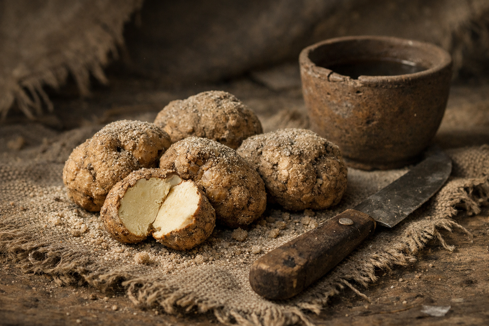

## What players would know

### Illustration (player-safe)

In polite church and court talk, “the desert truffle” or more ritually, “Sun-Blood” is rare, seasonal, and never discussed at full volume. It is said to grow only when the desert’s hidden water and heat happen to agree, and to spoil if handled by people who don’t know the road.

Most folk will never see one. What they see instead are the consequences: caravans delayed for “calendar reasons,” church custody tightening, and the sudden seriousness of officials who pretend belief is optional.

### Common rumors

- A late truffle season causes panic in places that pretend to be rational.
- The truffle can’t be farmed; it can only be _found_—and only by those who know how the desert moves.
- Some Travelers can smell the season the way sailors smell storms.

### See also

- [The Travelers](../factions/travelers.md)
- [Desert Bamboo (Fast-Growth Trees)](desert-bamboo.md)
- [The Desert (Living System)](../environments/the-desert.md)
- [Sacrament Administration](../institutions/sacrament-administration.md)
- [Church Caravans](../institutions/church-caravans.md)
