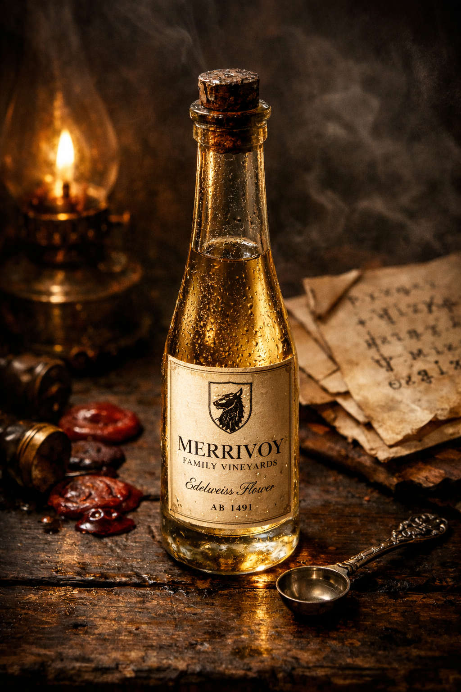

## What players would know

### Illustration (player-safe)

Distilled elf flower wine is a rare, highly concentrated spirit made from elven
flower vintages. Most people treat it as rumor: too expensive, too dangerous,
and too specific to be ordinary tavern vice.

In undercity speech, it is usually called **Dream Wine** or **Silent Clarity**.

### Common rumors

- A measured dose can make someone move "one heartbeat ahead" of everyone else.
- Counterfeit bottles are more common than real ones and kill faster.

### See also

- [Pitcher Sap](pitcher-sap.md)
