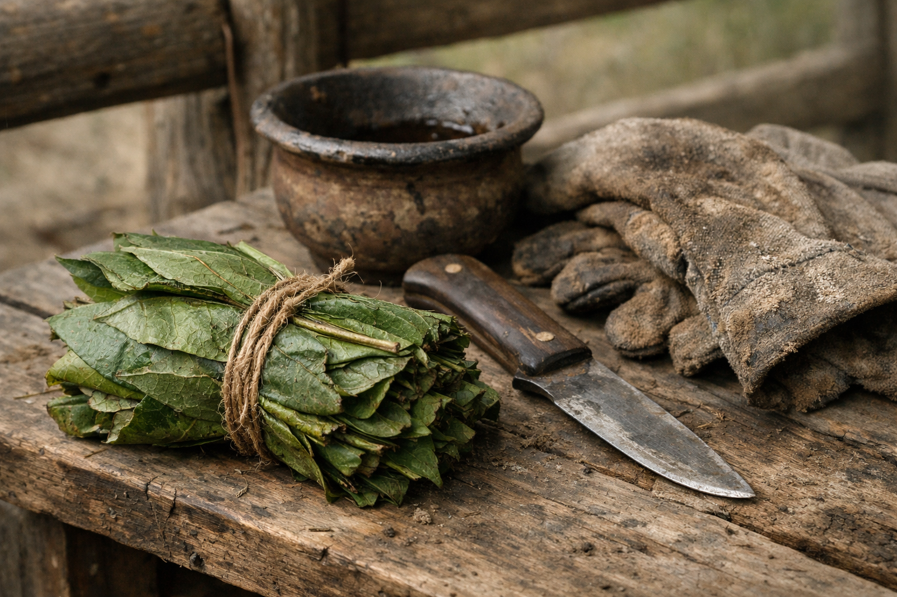

## What players would know

### Illustration (player-safe)

Druidic endurance leaf is a bitter chew used by hunters, messengers, field
laborers, and caravan walkers to push through long effort without collapsing.
It is practical, unglamorous, and common in rural exchange.

Street names include **Longwalk**, **Stonebite**, and **Workleaf**.

### Common rumors

- City people mock leaf-chewers until they need one on the road.
- Good leaf smells grassy and sharp; bad leaf smells sweet and wrong.

### See also

- [Distilled Elf Flower Wine](distilled-elf-flower-wine.md)
