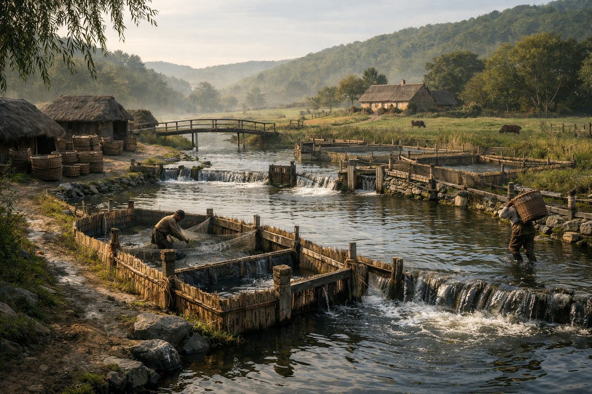

## What players would know

### Illustration (player-safe)

In river deltas, monastery ponds, and sheltered coastal pens, fish are raised the way grain is raised: patiently, in rows and fences you can’t see until you’re already trespassing. In lean years, fish keeps cities fed without the same public blood-and-ritual politics as herd slaughter.

If you want to understand who holds power in a “quiet” town, don’t count swords—count sluice gates, weirs, and the keys to pond locks. Water rights decide who eats, who sells, and who suddenly finds their nets cut.

### Common rumors

- Monasteries can “bless” a pond so the fish breed true, even in bad water.
- Some guilds would rather pay bandits than pay a canal inspector.
