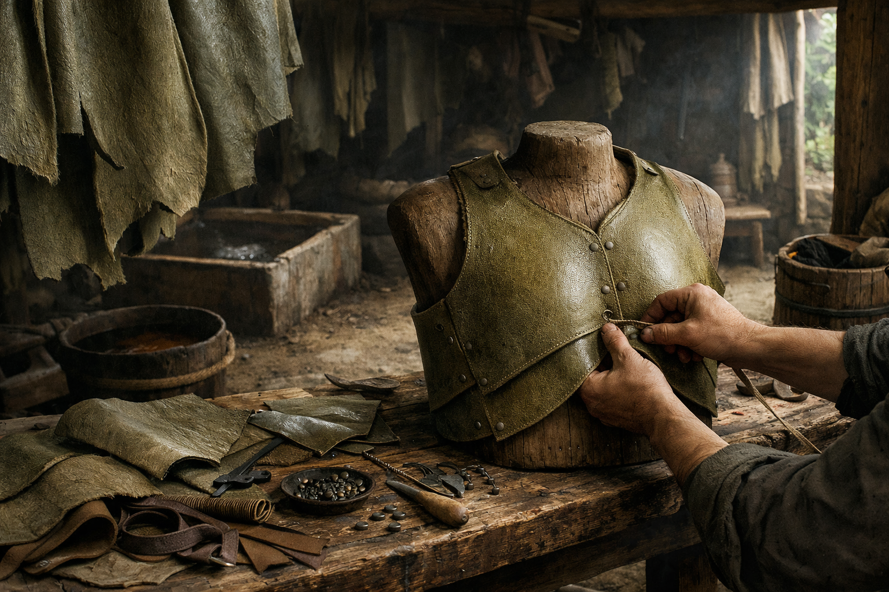

## What players would know

### Illustration (player-safe)

Hideleaf is “peasant leather”: thick green leaves cured until they’re tough enough for boots, aprons, and work coats. New hideleaf smells like limewater and bark tea, and it creases like stubborn paper until it learns your stride.

In the countryside it’s a blessing—shoes without slaughter. In cities it’s an argument. Some tanners and leatherworkers treat it as an insult to their craft; others buy it in bulk for armies and caravans because it’s cheap, durable, and doesn’t ask questions.

### Common rumors

- A man in hideleaf is either poor, practical, or lying about being both.
- Hideleaf boots last longer if you oil them with fish fat (and they smell like it).

### See also

- [The Central Wilds](../locations/central-wilds.md)
