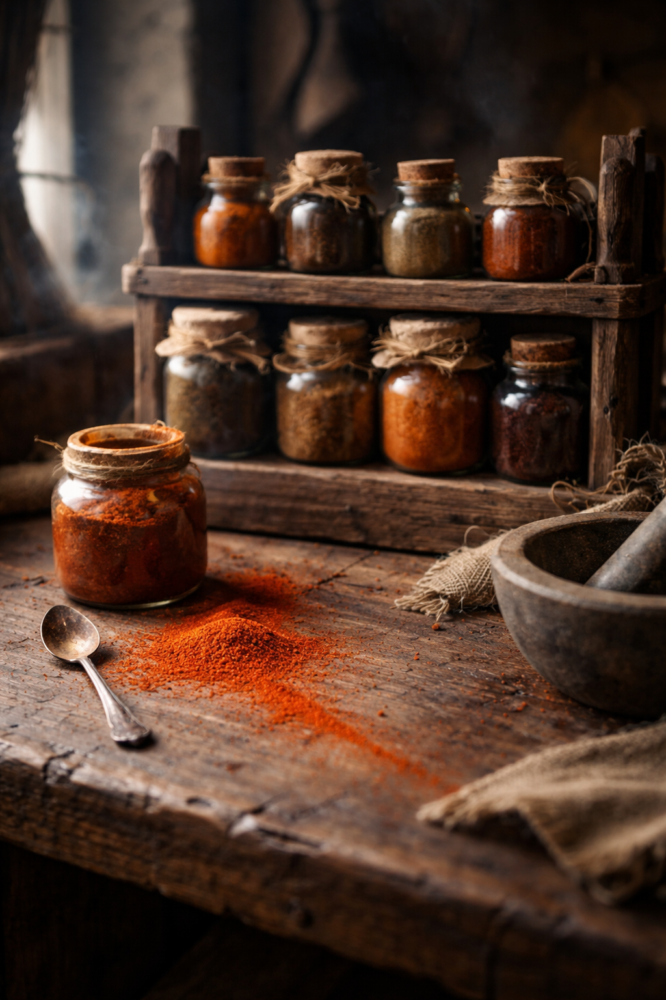

## What players would know

### Illustration (player-safe)

“Spice” in many markets isn’t a far-off flower or a noble’s imported powder—it’s insect heat: dried, crushed compounds taken from things that sting, bite, or burn predators for a living. Cooks call it borrowed heat; priests call it a test of the body’s honesty.

Most households keep mild blends for preservation and parasite-killing. The truly fierce powders—slow-bloom reds, sharp green flashes, black pepper that makes your ears ring—are status, dare, and sometimes medicine. Spice sellers are part gourmand, part apothecary, and they’ll watch you taste like they’re reading a confession.

### Common rumors

- The best spice comes from insects that only feed on yellow grass during the height of summer.
- Some “spice” isn’t heat at all—just a joy that makes you forget the hour.
