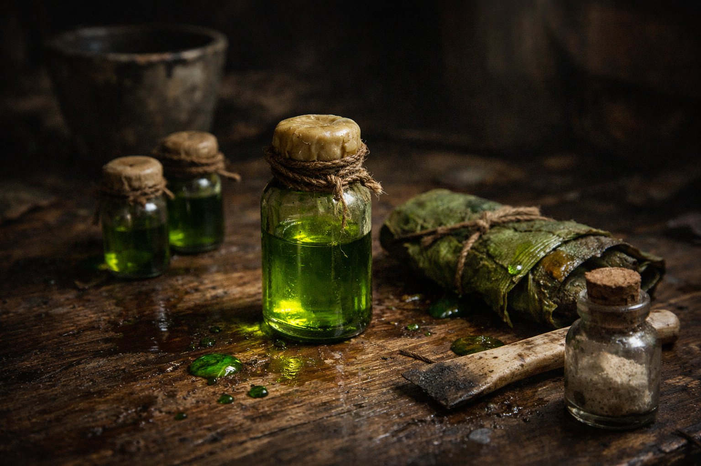

## What players would know

### Illustration (player-safe)

Pitcher sap is a jungle-harvested intoxicant resin traded in tiny vials and
leaf wraps. It is prized for confidence and feared for the same reason.

Street names include **Green Joy**, **Cupblood**, and **Laughing Resin**.

### Common rumors

- A strong batch makes fear feel optional.
- Most people who boast about handling sap are lying or dead.

### See also

- [Distilled Elf Flower Wine](distilled-elf-flower-wine.md)
- [Earth-Wound](../locations/earth-wound.md)
