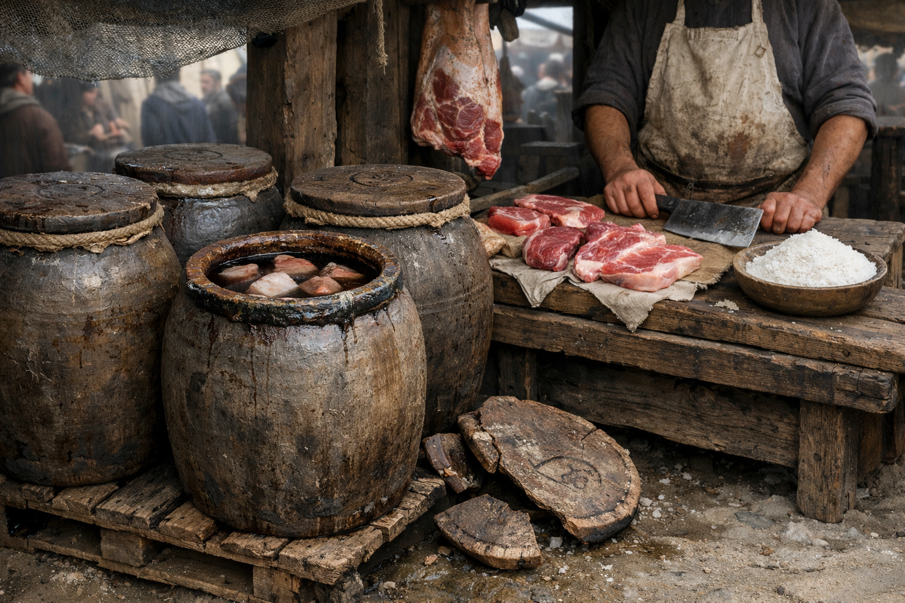

## What players would know

### Illustration (player-safe)

Salt pork travels in sealed clay jars: a food, a trade good, and—quietly—a unit of account. People don’t just buy “pork”; they buy “two jars of winter cut,” and the seal on the lid matters as much as the meat inside.

Jars are honest in a cruel way. A broken jar is loss you can’t talk your way out of. A missing jar is theft that stinks on the hands. Whole districts in big cities live off the empty jars after the pork is long gone—grain storage, pickling, ash, nails, poor burials.

### Common rumors

- Inspectors can smell a resealed lid the way a priest can smell fear.
- Old depots sometimes turn up with intact seals—either treasure, or trouble-by-brine.

### See also

- [Pottery, Kilns, and Trade Seals](pottery-and-seals.md)
- [Banking Guild](../factions/banking-guild.md)
- [City Watch](../institutions/city-watch.md)
