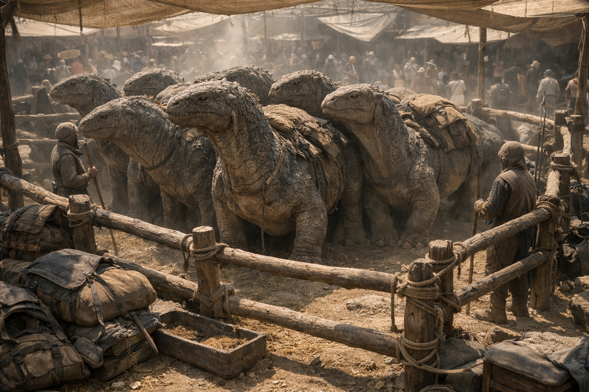

## What players would know

### Illustration (player-safe)

Saurakh are the caravans’ quiet miracle: huge herbivorous reptiles built for heat, distance, and long days under a harness. A good saurakh team can haul a life’s worth of goods across bad roads without eating itself into bankruptcy. A panicked saurakh can turn a crowded street into a disaster before anyone finishes shouting.

They are heat-tolerant and most active in the day in desert regions, but in high-altitude cold they become nearly motionless to conserve warmth. In temperate parts of the Empire they can be pushed into night travel under duress, though handlers consider it bad practice.

### Names you might hear

- Trade/guild standard: **Saurakh** (plural **Saurakhim**)
- Union civilian speech: **Sauracco**
- Elven territories: **Kethra**
- Desert tribes/caravans: **Druun**
- Soldiers/mercenaries: **Scale-mules**

### Common rumors

- Saurakh refuse to cross [Fey Roads](../magic/fey-roads.md) unless blindfolded or drugged.
- A spooked Saurakh can smell “wrongness in the air” before a mage can measure it.
- [Banking Guild](../factions/banking-guild.md) couriers prefer Saurakh teams around warded cargo: they don’t panic the way horses do.
