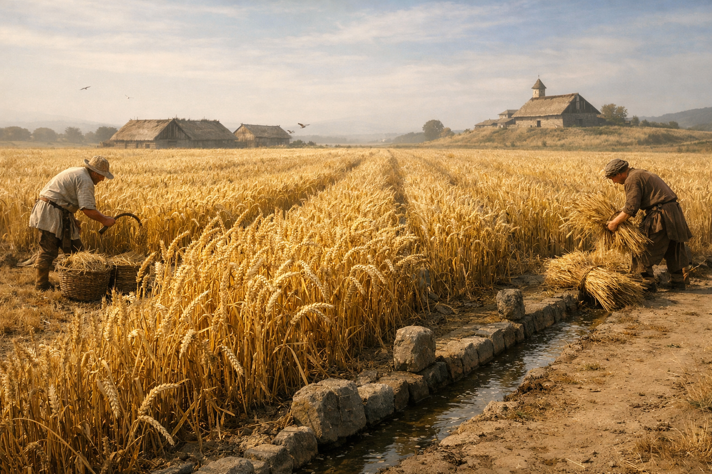

## What players would know

### Illustration (player-safe)

Yellow grass is the staple that keeps bellies full and borders worth fighting over. It bakes into pale bread, ferments into common beer, and hardens into travel rations that don’t rot as quickly as older grains. Where yellow grass grows well, people multiply; where it fails, politics turns sharp.

Farmers talk about it like it has moods. A cloudy summer can thin the harvest; a bad rotation can “tire the soil.” Caravans haul it by the sack and the jar, and monasteries keep careful stores because hunger makes heresy loud.

### Common rumors

- The yellow in the stalk is “stored sunlight,” and certain priests insist you can taste the season in the crust.
- Some old families claim the elves taught the crop… and taught it to be dependent, too.

### See also

- [Fish Farming](fish-farming.md)
- [Insect Spice (Borrowed Heat)](insect-spice.md)
- [Church Caravans](../institutions/church-caravans.md)
- [Sacrament Administration](../institutions/sacrament-administration.md)
