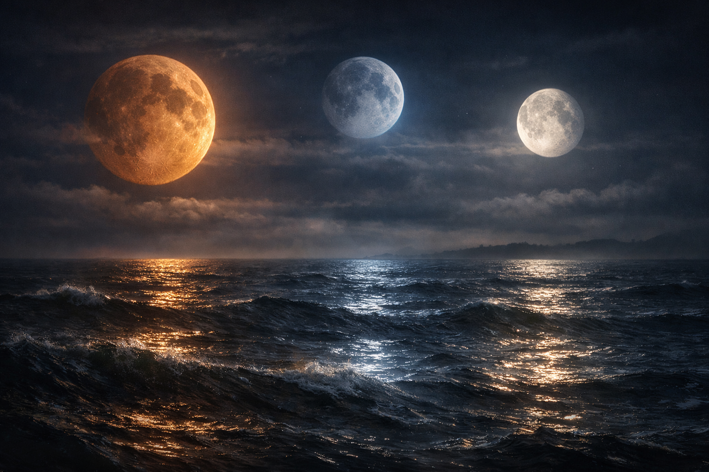

## What players would know

### Illustration (player-safe)

Qualihut has three moons, and the world behaves like it knows that. Tides argue. Sleep is not uniform. Magic has “good nights” and “bad nights” the way weather has fronts.

Most folk don’t track the whole sky. They track what matters to them:

- Sailors care which moon is pulling hardest.
- Midwives care which moon makes blood easy or stubborn.
- Undertakers care which moon makes memory linger.

People argue about calendars, but agree on one thing: when the moons align strangely, the world gets _soft_ in ways you can’t litigate.

### Common rumors

- One moon is always “high” (strong), one is fading, and one is quiet. The world is never neutral.
- Triple alignment is rare and weird: births don’t fit lineage, vows bind too hard, and old stories walk around like they own the place.
- Triple alignment comes about once in a lifetime—roughly every four decades—and every calendar lies about the exact week.
- The Solar Church pretends its miracles ignore the moons. Everybody else plans around them.

### See also

- [Elunara](../people/magical-creatures/elunara.md)
- [The Three-Moon Sea](the-three-moon-sea.md)
