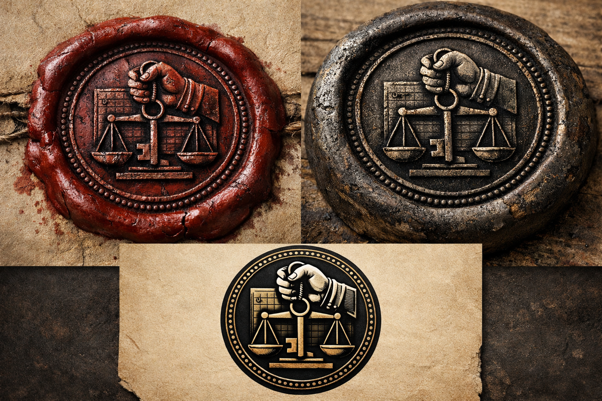

## What players would know

### Illustration (player-safe)

The Banking Guild—formally **Il Consorzio della Mano Sicura**—is turning trust into infrastructure. Where old lords demanded coin, the Guild offers paper backed by vaults, seals, and a ritualized promise: your note can be redeemed, witnessed, and made real.

In cities with strong guild presence, promissory notes start to behave like a trade standard. Merchants stop weighing coin and start weighing reputation. In places without it, the notes are still just paper—until someone with a ledger and a militia decides they aren’t.

### Common rumors

- Guild vaults hold unusual reserves.
- Debtors sometimes vanish into “administrative disputes.”
