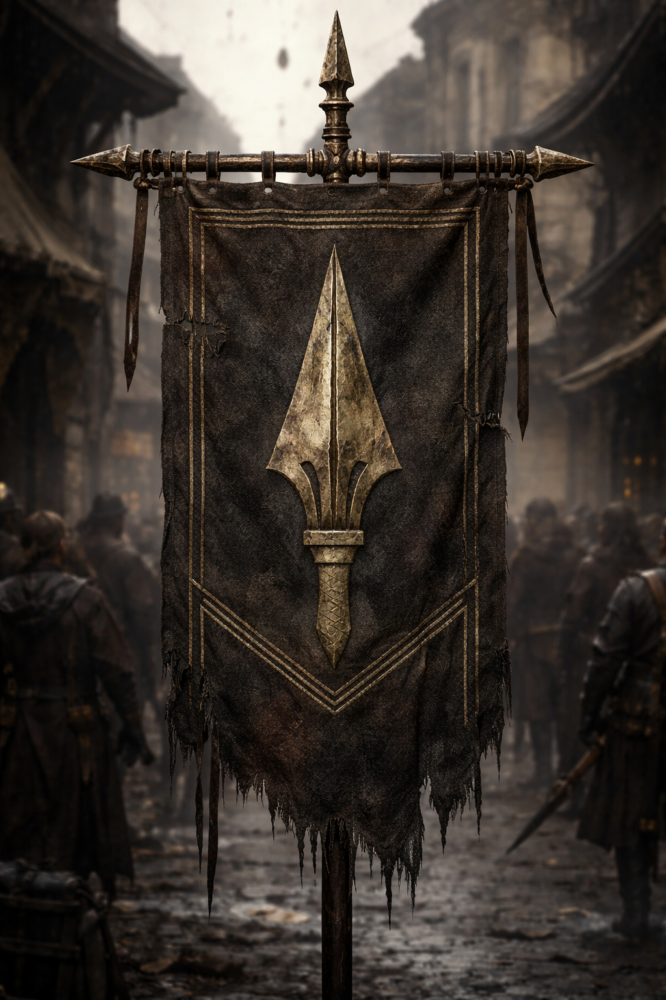

## What players would know

### Illustration (player-safe)

The Brazen Pike Company is a contract mercenary outfit that sells disciplined
escort work: caravan protection, checkpoint muscle, debt-collection security,
and short-term gate control when local militias are stretched thin.

They are known for clear rates, written witness logs, and not drinking while on
watch.

### Common rumors

- If the Brazen Pike banner is on a caravan, trouble usually finds softer prey.
- Their quartermasters ask more questions than their captains.
