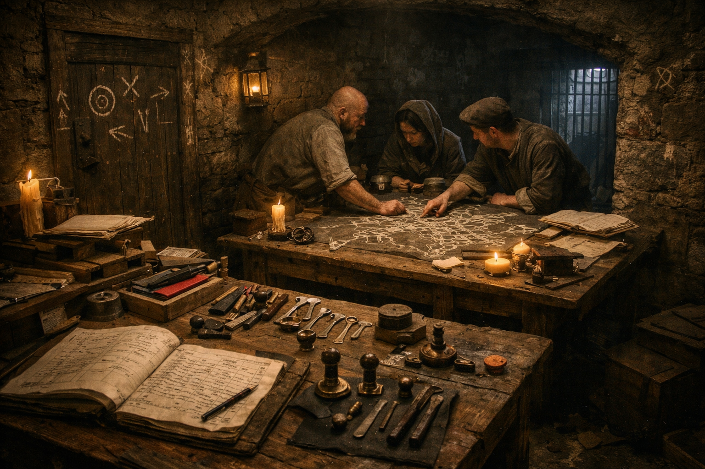

## What players would know

### Illustration (player-safe)

<!-- Replace with a player-safe image path next to this .md. -->

La Compagnia del Gesso Bianco is a thieves' guild known for jobs that avoid
blood: burglary, pickpocketing, and fraud done with timing and paperwork instead
of open violence. They are associated with chalk marks on doorframes and market
posts, though no one agrees what the symbols actually mean.

In crowded districts, they are blamed for "clean losses": coin pouches gone
without cut straps, lockboxes opened without broken hinges, and debt records
that change hands before the ink is dry.

### Common rumors

- They case neighborhoods by posing as copyists, clerks, and tally-runners.
- If Gesso Bianco steals from you, you'll notice three days later, not three seconds later.
