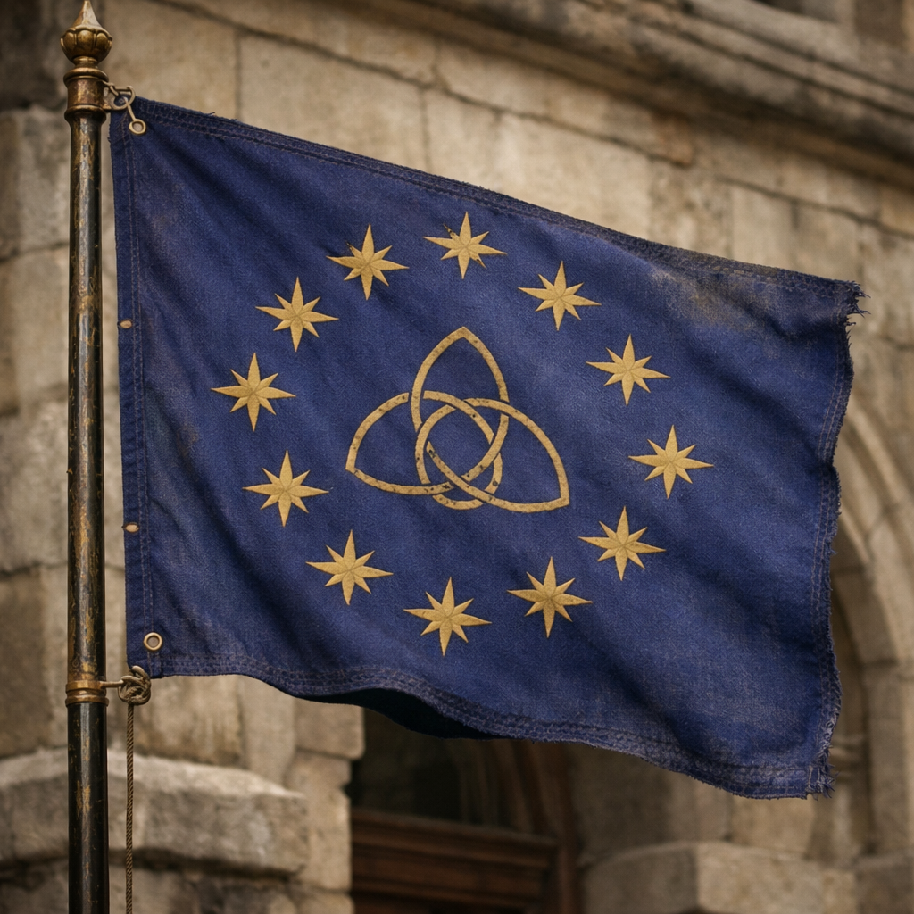

## What players would know

### Illustration (player-safe)

The Southern Union is a cluster of nations bound together by treaty and trade—close enough in strength to the Empire that open war would be ruinous for everyone, and therefore threatened constantly in speeches nobody intends to honor.

Union diplomats smile like merchants and argue like lawyers. In border taverns you hear two stories at once: that the Union is a civilized alternative to imperial feudal rot, and that the Union is a patient machine that prefers sabotage to banners.

### Common rumors

- “Union coin spends anywhere” (and Union promises spend twice).
- If a monastery burns in the wilds, someone in the south will call it “self‑determination.”
