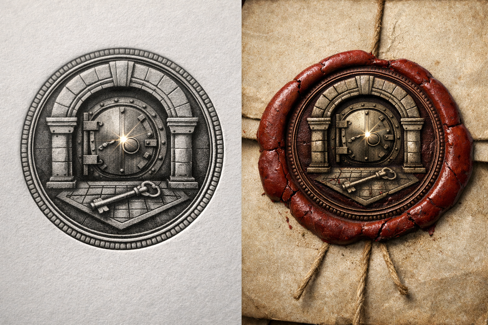

## What players would know

### Illustration (player-safe)

Banco Valdieri is one of [Hochsilvar](../locations/hochsilvar.md)’s marble-faced certainties: reputable, wealthy, and guarded like a minor palace. It sits close to the [Banking Guild](../factions/banking-guild.md)’s promissory-note experiment, where paper promises are backed by refined magic and the public is asked to believe the ledgers.

If you want to know how much power a bank has, don’t look at its coin—look at who defers to it. Valdieri gets visits from guild representatives, court couriers, and people who never give their full names.

### Common rumors

- Their vaults hold “more than coin.”
- A Valdieri account opens doors that shouldn’t open.

### See also

- [Magister Argentum Alarich von Silberhain](../people/npcs/alarich-von-silberhain.md)
- [Giovanni Valdieri](../people/npcs/giovanni-valdieri.md)
