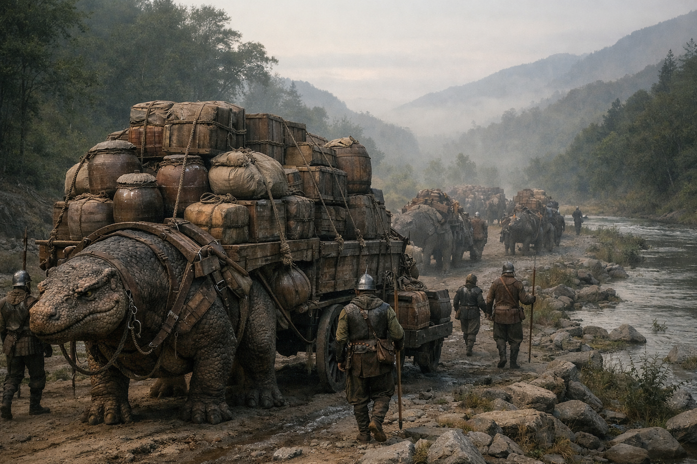

## What players would know

### Illustration (player-safe)

The Broadbarrel Caravan is a slow, heavy staple convoy: salt pork jars, ale
kegs, and yellow-grass sacks hauled in bulk under strict schedules.

It is run by [Henrik Volmar](../people/npcs/henrik-volmar.md) and currently
travels with hired [Brazen Pike Company](../factions/brazen-pike-company.md)
security.

### Common rumors

- If you need food moved through bad country, Broadbarrel usually delivers.
- Their guard contract is expensive enough to scare off petty trouble.
