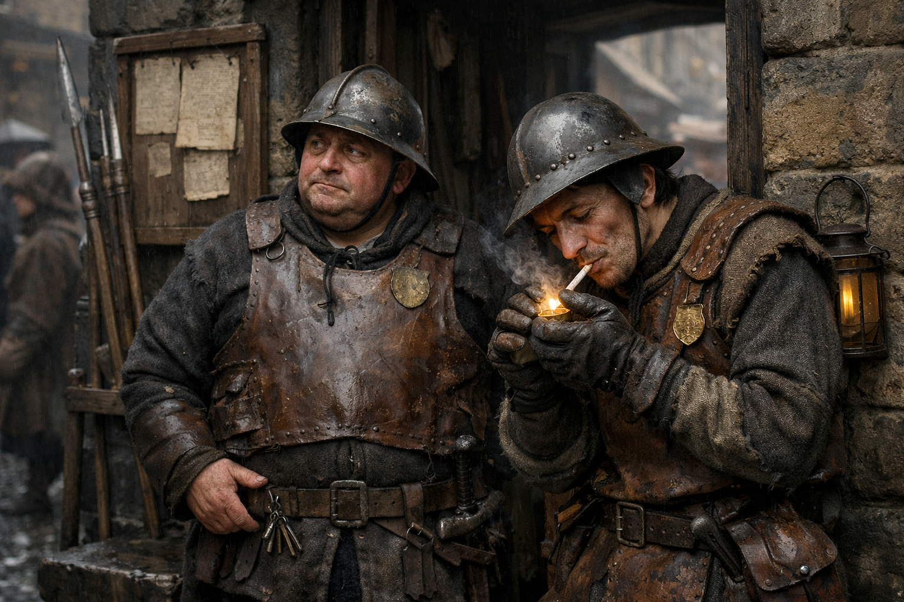

## What players would know

### Illustration (player-safe)

City Watch patrols keep order the way a tired person keeps a room clean: by deciding what mess is “normal.” They’re underpaid, stretched thin, and often more local than lawful—loyal to districts, captains, and survival.

Watch captains spend as much time balancing guild pressure against magistrate orders as they do chasing criminals. The result is uneven enforcement that looks like corruption to outsiders and looks like “not getting everyone killed” to the people doing the work.

### Common rumors

- A guild coin buys faster justice than a badge.
- City watch units and guild enforcers skirmish after dark.
