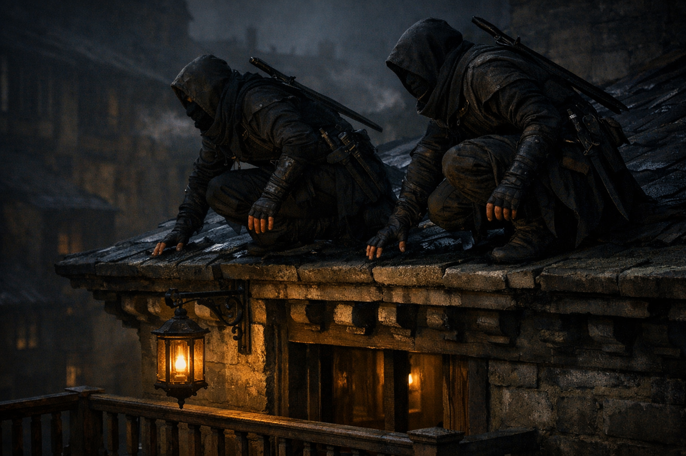

## What players would know

### Illustration (player-safe)

The Cult of Ink is spoken of in the same voice people use for plague and debt: low, practical, and a little superstitious. They are contract killers—allegedly neutral, allegedly precise, and allegedly bound by written terms so strict they will not “improvise mercy” even if begged.

In some cities, a small black droplet painted on a doorframe is enough to make a landlord suddenly decide to be reasonable. In others, it’s just a joke thieves tell each other. Either way, most people agree on one thing: if the Cult has your name in ink, the law won’t save you—only a better contract will.

### Common rumors

- They don’t take sides, only clauses.
- Their tattoos are not decoration; they’re vows you can’t wash off.
