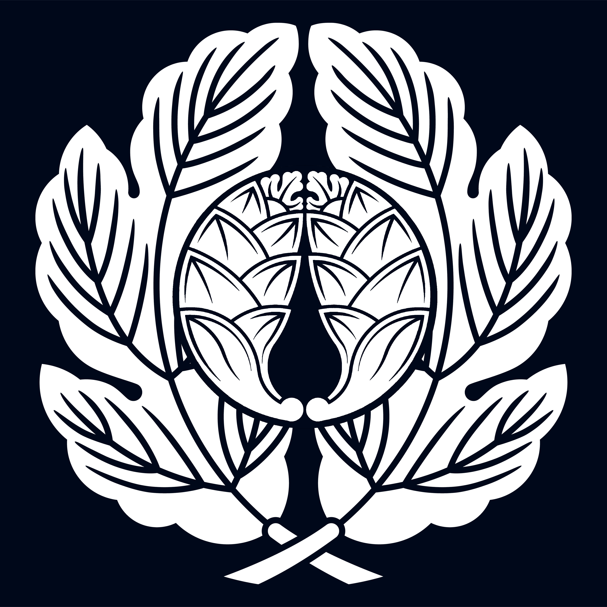

## What players would know

House Orsatti is one of the Twenty Houses. It is most often associated with
cavalry studs, draft-beast breeding, and stable intelligence networks.

They convert animal logistics into military and commercial foresight.

### Sigil (player-safe)

### Common rumors

- Orsatti knows who is moving troops by counting horse feed orders.
- Their breeders can bankrupt rivals by controlling quality bloodstock.

### See also

- [Noble House Roster (Twenty Houses)](noble-house-roster.md)
