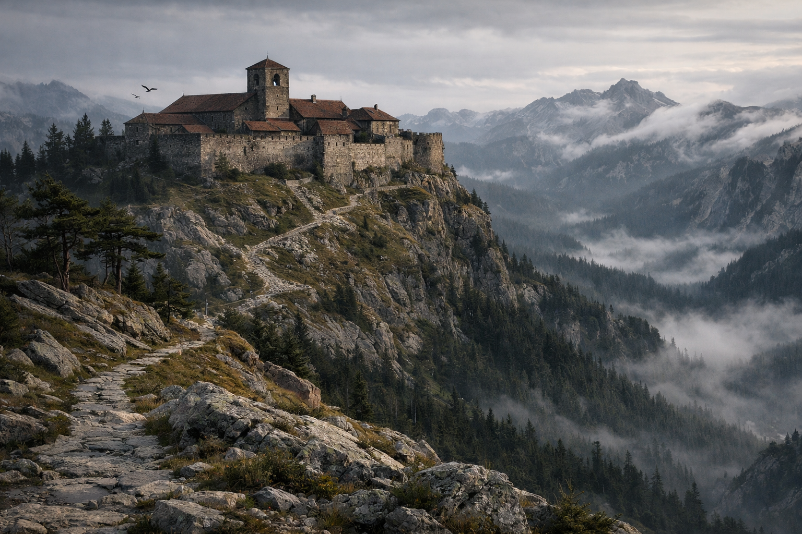

## What players would know

### Illustration (player-safe)

Imperial monasteries sit where towns don’t: on dangerous roads, near old stones, and in valleys where the wind sounds like it’s remembering something. To travelers they’re refuge—warmth, bread, a place to sleep without a knife at your throat. To officials they’re outposts, record houses, and quiet points of influence beyond city walls.

Some monasteries are thriving, with gardens and disciplined hospitality. Others are half‑abandoned, still tended by a handful of stubborn monks who act like the world ending is just another chore. Either way, people speak of monasteries as places where you can ask for help… and where help always comes with a lesson.

### Common rumors

- Monks know which roads are “wrong” this season, even when maps insist they’re fine.
- An abandoned monastery is never truly empty; it’s just between owners.
