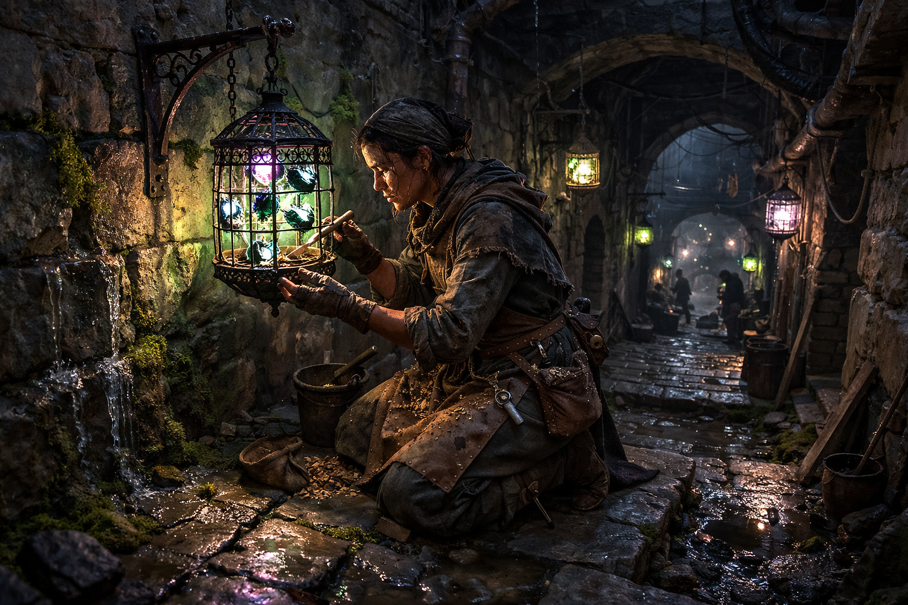

## What players would know

### Illustration (player-safe)

The Lamp Feeders are Niederstadt's municipal lighting crews. They maintain
caged bioluminescent beetles that light tunnels, stairs, and market approaches
through the undercity night.

Most residents barely notice them until a lane goes dim, a mugging spike
starts, or a district complains that "the lamps feel wrong."

### Common rumors

- Rich lanes get brighter cages and fresher feed.
- A feeder can read tunnel trouble by glow color before anyone files a report.
- Smashing a lamp cage is stupid; culling quietly is how professionals make
  darkness.

### See also

- [Nieder Lamp Beetle](../monsters/nieder-lamp-beetle.md)
