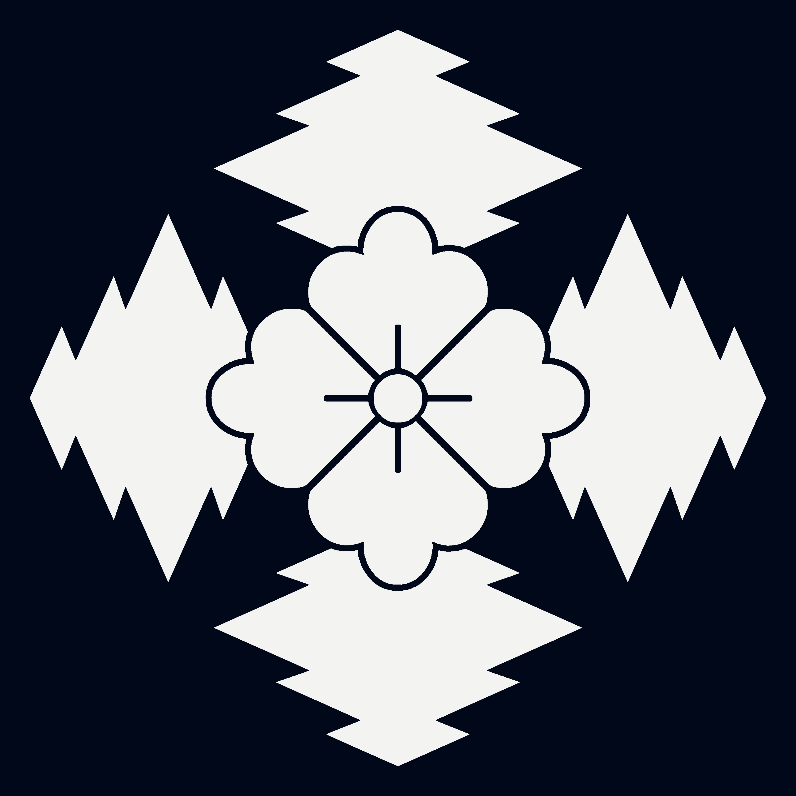

## What players would know

Court clerks, card printers, and heralds often talk about the "Twenty Houses":
the noble roster most commonly used for state ceremonies, betting decks, and
marriage politics. Different cities argue about rank order, but the names are
widely recognized.

## The Twenty Houses (common register)

1. [House von Sonnenfels](house-von-sonnenfels.md)
2. [House von Dornfels](house-von-dornfels.md)
3. [House von Eichenwald](house-von-eichenwald.md)
4. [House von Hirschkrone](house-von-hirschkrone.md)
5. [House von Stillwort](house-von-stillwort.md)
6. [House von Silberhain](house-von-silberhain.md)
7. [House Venturi](house-venturi.md)
8. [House von Grauband](house-von-grauband.md)
9. [House Ventresca](house-ventresca.md)
10. [House Malvieri](house-malvieri.md)
11. [House Orsini](house-orsini.md)
12. [House Sforzetti](house-sforzetti.md)
13. [House von Falkenried](house-von-falkenried.md)
14. [House von Hartwyck](house-von-hartwyck.md)
15. [House von Kaltbruck](house-von-kaltbruck.md)
16. [House von Eisenforst](house-von-eisenforst.md)
17. [House Bellarossa](house-bellarossa.md)
18. [House von Nachtquell](house-von-nachtquell.md)
19. [House Orsatti](house-orsatti.md)
20. [House von Weissdorn](house-von-weissdorn.md)

### House Sigil Grid (5 x 4)

| 1                                                                                                                       | 2                                                                                                               | 3                                                                                                                       | 4                                                                                                                           | 5                                                                                                                   |
| ----------------------------------------------------------------------------------------------------------------------- | --------------------------------------------------------------------------------------------------------------- | ----------------------------------------------------------------------------------------------------------------------- | --------------------------------------------------------------------------------------------------------------------------- | ------------------------------------------------------------------------------------------------------------------- |
|  [House von Sonnenfels](house-von-sonnenfels.md) |  [House von Dornfels](house-von-dornfels.md) |  [House von Eichenwald](house-von-eichenwald.md) |  [House von Hirschkrone](house-von-hirschkrone.md) |  [House von Stillwort](house-von-stillwort.md) |
|  [House von Silberhain](house-von-silberhain.md) |  [House Venturi](house-venturi.md)                     |  [House von Grauband](house-von-grauband.md)         |  [House Ventresca](house-ventresca.md)                         |  [House Malvieri](house-malvieri.md)                     |
|  [House Orsini](house-orsini.md)                                 |  [House Sforzetti](house-sforzetti.md)             |  [House von Falkenried](house-von-falkenried.md) |  [House von Hartwyck](house-von-hartwyck.md)             |  [House von Kaltbruck](house-von-kaltbruck.md) |
|  [House von Eisenforst](house-von-eisenforst.md) |  [House Bellarossa](house-bellarossa.md)         |  [House von Nachtquell](house-von-nachtquell.md) |  [House Orsatti](house-orsatti.md)                                 |  [House von Weissdorn](house-von-weissdorn.md) |

## House alignments (court shorthand)

Most courts sort 19 of the houses into two long-standing elven cultural blocs:

- **Verdant houses**: usually associated with wood-elf lineage norms
  (forest estates, stewardship rhetoric, long-cycle land politics).
- **Umbral houses**: usually associated with dark-elf lineage norms
  (subterranean holdings, secrecy discipline, infrastructure and covert leverage).

The imperial line, **[House von Sonnenfels](house-von-sonnenfels.md)**, is treated as a separate
sun-legitimacy line and is not counted in either bloc.

### Common rumors

- The "five-suit noble deck" used in gambling houses encodes these families as
  cultural propaganda.
- Inheritance wars are usually contract wars with better clothing.
