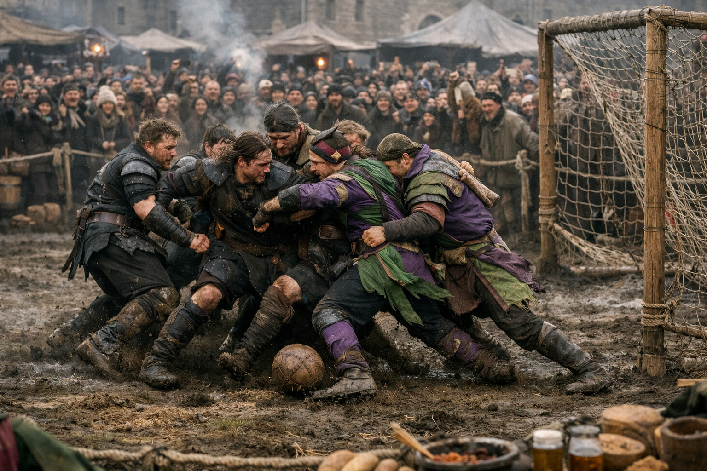

## What players would know

### Illustration (player-safe)

The Royal Games are a solstice week when the capital forgets it is a city and remembers it is a crowd. Teams from villages, wards, docks, monasteries, and mining hollows all pour in for matches that are half sport and half civic ritual. Betting flows like wine, and the streets feel one spark away from riot in both directions—joy and violence sharing a spine.

Everyone knows the “rules” that matter: the ball is blessed but never enchanted, nobles sponsor quietly and dress plainly at the final, and the monarch must attend. In taverns, people say the Games are the only time the Empire tells the truth about itself: what it loves, what it hates, and how quickly it will trample anyone in the way.

### Common rumors

- A curse laid in the stands can spread through chants faster than fire.
