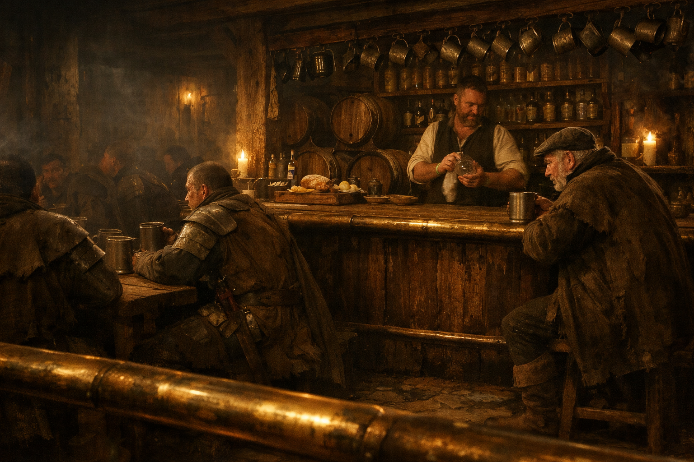

## What players would know

### Illustration (player-safe)

The Brass Buckler is a City Watch watering hole: cheap beer, hard benches, and a
roomful of tired people trying to forget the city for an hour without admitting
they can’t.

It sits close enough to Watch foot traffic that the regulars don’t bother hiding
their badges—only their opinions.

### Common rumors

- If you want a permit expedited, you drink here first.
- Fights are rare, because everyone is armed and everyone is employed.

### See also

- [City Watch](../institutions/city-watch.md)
