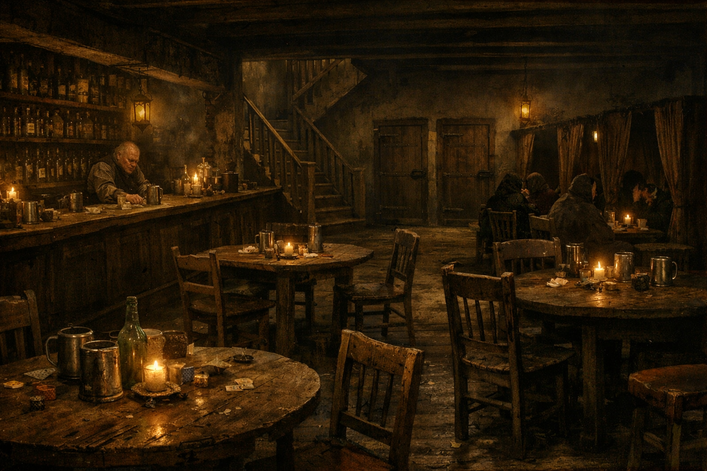

## What players would know

### Illustration (player-safe)

Casa dei Tre Spilli is one of those Niederstadt houses that pretends to be
three businesses at once: alterations, private rooms, and quiet company. The
front looks harmless enough. The side stair looks like it has heard
confessions. Locals often shorten it to
[Tre Silli (Niederstadt)](tre-silli.md) when they do not want to sound either
formal or precise.

### Common rumors

- If you need a hem fixed and don't ask questions, they are quick.
- If you need privacy and do ask questions, they charge extra.
