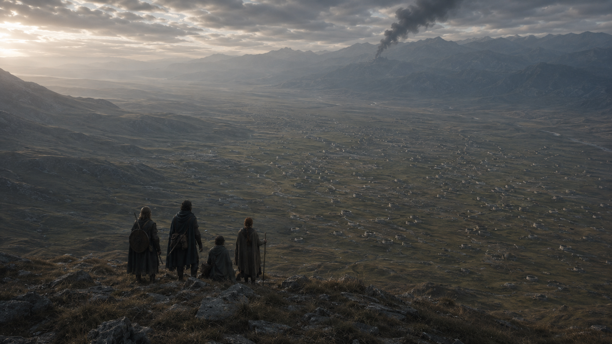

## What players would know

From the high ground above the Plain of Giant's Cups, a dark smoke column can
be seen rising from a remote monastery on the far mountain. The place is
roughly 100 km away: near enough for the smoke to make the day feel wrong, too
far away for anyone on the road to say what is burning or who started it.

Travelers watch the column until cloud or night takes it. No alarm reaches the
plain; only the sight remains, and the uneasy question of whether to turn
toward it.

### See also

- [Plain of Giant's Cups](plain-of-giants-cups.md)
