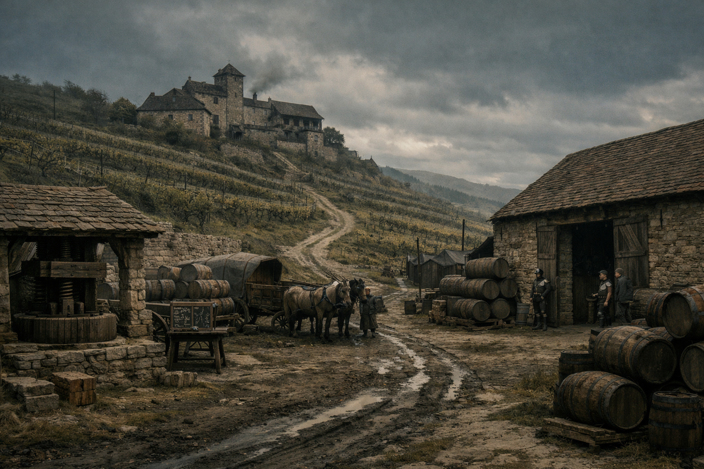

## What players would know

### Illustration (player-safe)

<!-- Replace with a player-safe image path next to this .md. -->

Duvalli Vineyard is spoken of as a remote wine estate supplying select merchants in Hochsilvar. Most people know it by label, not by map.

Caravans that claim Duvalli origin are treated as routine trade, which makes the name useful for legitimate commerce and suspicious movement alike.

### Common rumors

- The vineyard’s best years correlate suspiciously well with years of border unrest.
- Some “Duvalli” consignments never touched vines at all.
