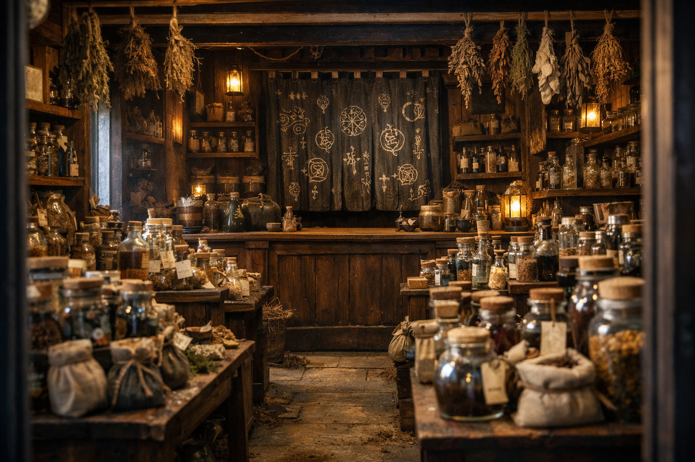
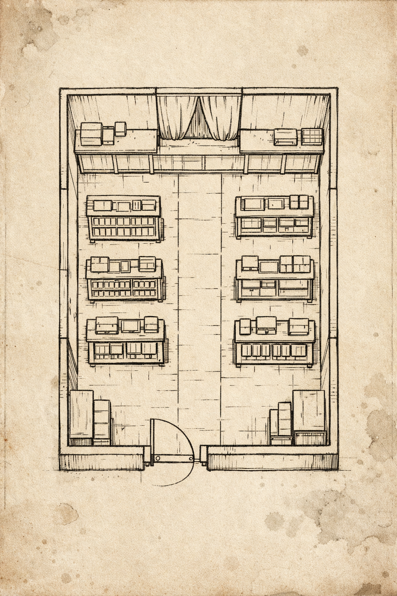

## What players would know

Glass & Moth is a licensed curios and ingredients shop in Hochsilvar's wealthy core, tucked into the [Banco Valdieri Quarter](banco-valdieri-quarter.md). It sells the practical end of magic: things you can measure, label, seal, and argue about.

The proprietor is [Mordecai Orichalcum](../people/npcs/mordecai-orichalcum.md).

### View from the front door

The front half of the shop is waist-high racks and tables crammed with ingredients in bottles, jars, and bags, plus bundles of dried things tied with twine: roots, lichen, resin sticks, cracked shells, feather fans, salts, inks, and powders that want to cling to your fingertips.

Toward the back, the room narrows into a single point of sale: a heavy counter that divides "browsing" from "custody." Behind the counter hangs a curtain like a Japanese noren, covered in mystical sigils. It reads as a boundary more than a decoration.

### Map (player-safe)

Key:

- `A` Front racks: ingredients, bundles, and labeled jars.
- `B` Narrow aisle: the only clean path to the counter.
- `C` Back counter: purchases, advice, receipts, and refusals.
- `D` Sigiled curtain: back room threshold (staff only, unless invited).

### Common rumors

- If you touch the wrong jar without asking, you forget what you meant to buy.
- Nothing in the front racks is truly dangerous. The dangerous things are behind the curtain.
- The staff can tell who has handled refined magic recently, just by the residue it leaves in your habits.
