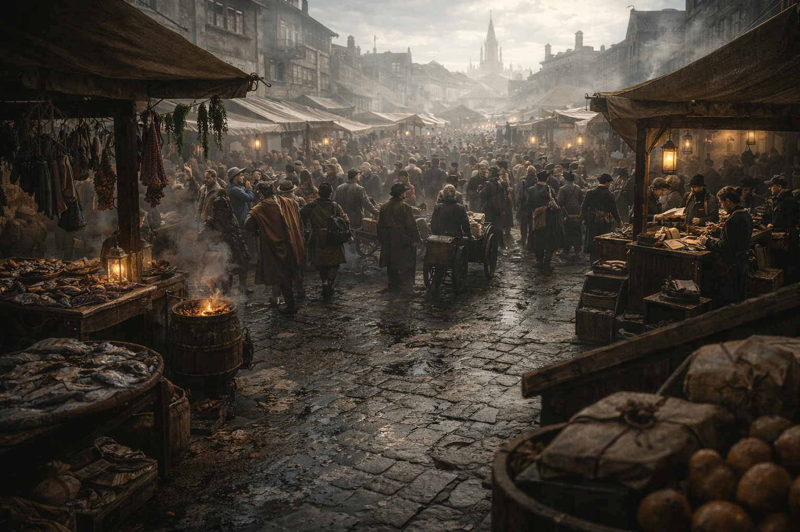

## What players would know

This is Hochsilvar’s main city-square market: a loud wet market where food, candles, rope, soap, and small mercies are bought in the open air beneath Watch eyes.

During **[The Royal Games](../institutions/royal-games.md)** it becomes a moving wall of bodies—chants, drunk supporters, and temporary stalls swelling the lanes until you can’t tell whether you’re being jostled by accident or assessed.

### Common rumors

- If you can’t find it in the Square, it doesn’t exist (yet).
- Pickpockets work in teams, and the Watch pretends not to see until the wrong victim is chosen.
- The best information in the city is traded over fish scales and bruised fruit.
