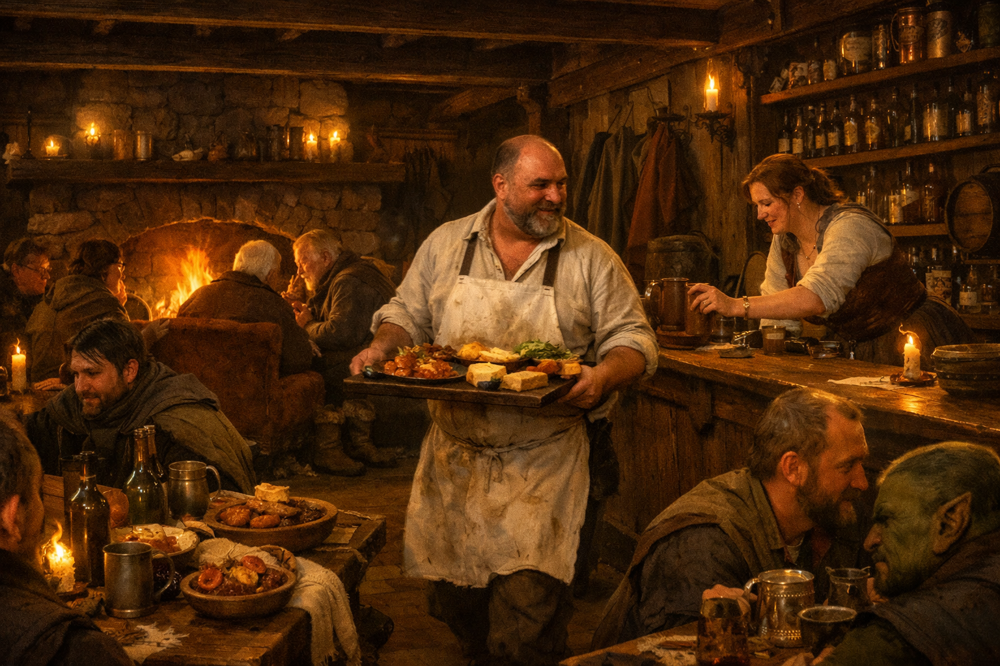

## What players would know

### Illustration (player-safe)

The Last Lantern Inn sits near one of Hochsilvar’s city gates, close enough to
hear the guards calling names and close enough that the first drink after an
inspection tastes like mercy.

It attracts travelers, caravan hands, and anyone who prefers to sleep with a
locked door between them and the road.

### Common rumors

- If you can’t find a guide here, you can find someone who knows a guide.
- The stew is better on gate-days, because everyone is hungry at the same time.

### See also

- [Hochsilvar](hochsilvar.md)
- [Travelers](../factions/travelers.md)
