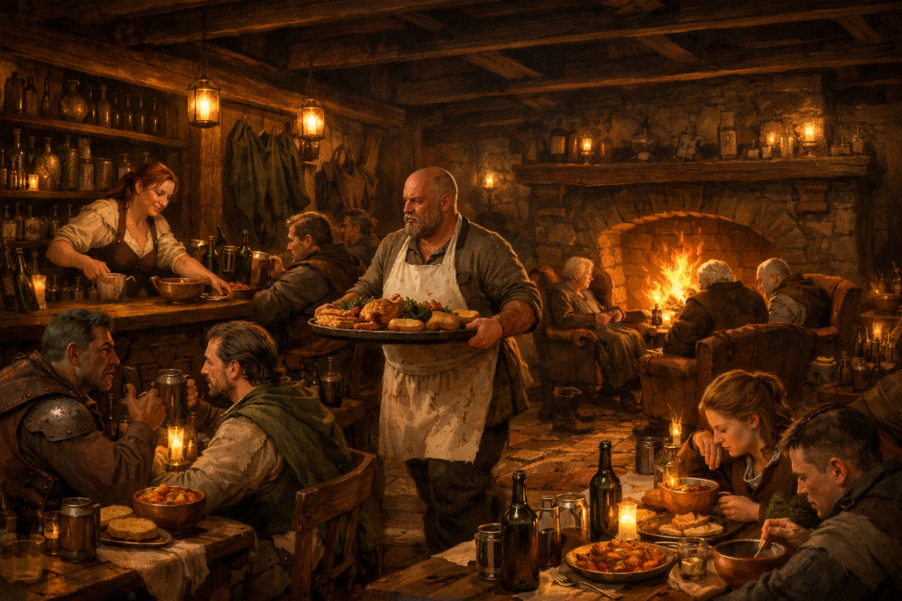

## What players would know

### Illustration (player-safe)

The Last Lantern Inn sits near one of Hochsilvar’s city gates, close enough to
hear the guards calling names and close enough that the first drink after an
inspection tastes like mercy.

It attracts travelers, caravan hands, and anyone who prefers to sleep with a
locked door between them and the road.

This week, town criers and fresh posters around the gate district are pushing a
special attraction: **Bob Johnson and Boy Willie Brown, the legendary pair from
[Statesboro](statesboro.md)**, playing evening sets of road-laments, lost-love
songs, and crossroads ballads.

One crier version making the rounds:

> Two nights only at the Last Lantern! Bob Johnson and Boy Willie Brown of
> Statesboro! Songs for the loves you lost and the roads that remember you!

One poster version pasted up near porter stalls:

> THE STATESBORO PAIR
> BOB JOHNSON & BOY WILLIE BROWN
> AT THE LAST LANTERN
> TWO NIGHTS ONLY

### Common rumors

- If you can’t find a guide here, you can find someone who knows a guide.
- The stew is better on gate-days, because everyone is hungry at the same time.
- The musicians from Statesboro can make a room go quiet without raising their
  voices.

### See also

- [Hochsilvar](hochsilvar.md)
- [Statesboro](statesboro.md)
- [The River Marches](river-marches.md)
- [Statesboro Dance and Performance](statesboro-dance-and-performance.md)
- [Statesboro Songbook](statesboro-songbook.md)
- [Travelers](../factions/travelers.md)
- [Bob Johnson](../people/npcs/bob-johnson.md)
- [Boy Willie Brown](../people/npcs/boy-willie-brown.md)
