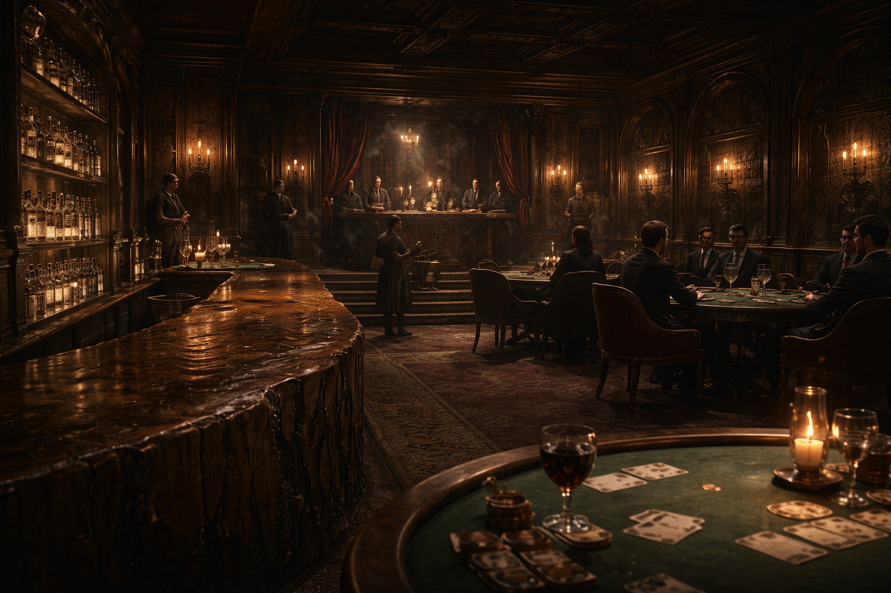

## What players would know

The Ivory Wheel is a fashionable casino in a wealthy quarter: warm lamplight,
polished wood, discreet guards, and enough velvet to make honest people
uncomfortable. Most patrons never see the highrollers’ rooms. Those who do don’t
talk about what they lost there.

### Public areas (what you can actually see)

- **Front steps + doormen**: dress and posture are checked before coin is.
- **Coat check / “courtesy” weapons desk**: polite lockers and receipts.
- **Main gaming floor**: cards, dice, wheel tables; loud enough to hide a lie.
- **Cashier / chip cage**: thick bars, sealed slips, and the feeling of a bank in miniature.
- **Bar + small stage**: music that makes time blurry and conversations feel private.
- **Balcony rail / upper walk**: a place to watch the room without being in it.
- **Public sitting alcoves**: velvet benches for negotiations that pretend to be flirting.

### Common rumors

- The Wheel can make debts “go away” if you’re the right kind of desperate.
- Some wins are just auditions.

### See also

- [La Mano Fortunata](../factions/mano-fortunata.md)
