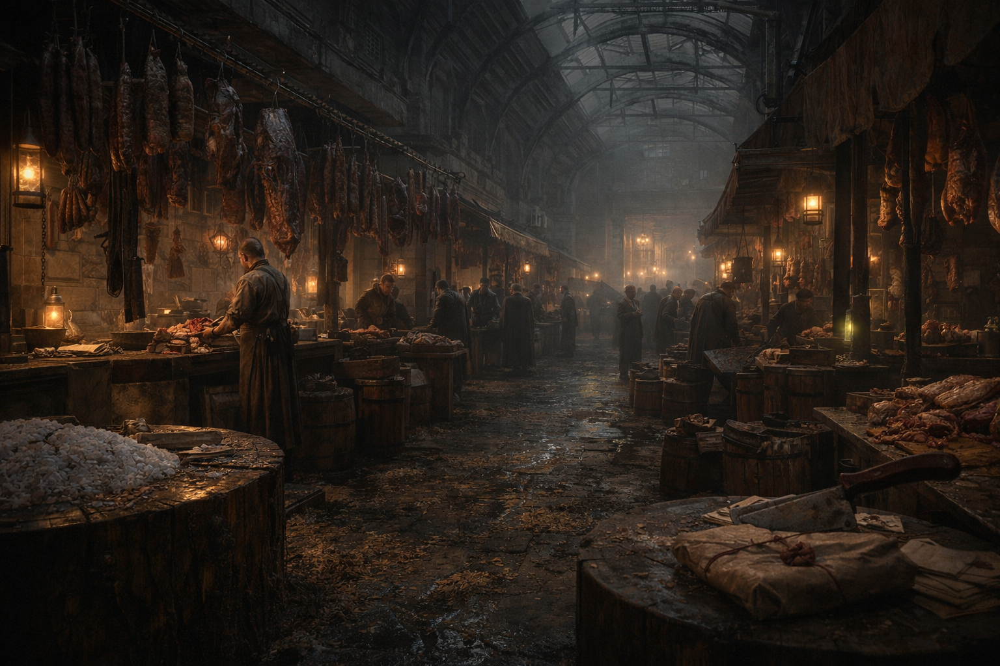

## What players would know

Avenue of Butchers is Niederstadt’s meat street: a long, covered lane of hooks, smoke, salt, and knives where people buy what keeps and sells what doesn’t.

They’re famous for charcuterie that travels well—sausages, smoked cuts, cured strips—food built for laborers, caravans, and anyone who wants a meal that doesn’t ask questions.

### Common rumors

- If you need something “kept cold” without ice, you go to the Avenue.
- The knives here are sharper than the Watch’s questions.
- Everybody owes somebody a favor on meat street.
