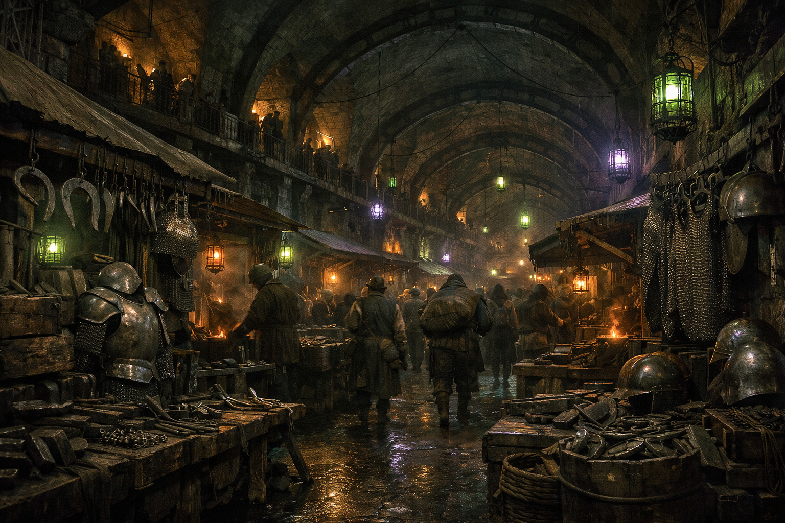

## What players would know

The Deep Market is Niederstadt’s hard commerce: food that keeps in damp stone, tools that don’t ask questions, and stalls where metalwork, armor fittings, and “spare” weapons are sold with the calm efficiency of people who expect inspections to fail.

It’s the kind of market where you can buy a meal, a pry bar, and a lie within twenty paces.

### Common rumors

- You don’t haggle over price here; you haggle over what gets remembered.
- If you see a “new” blade on a stall, someone bled for it already.
- The safest way to buy a weapon is to buy three and leave one as a courtesy.
