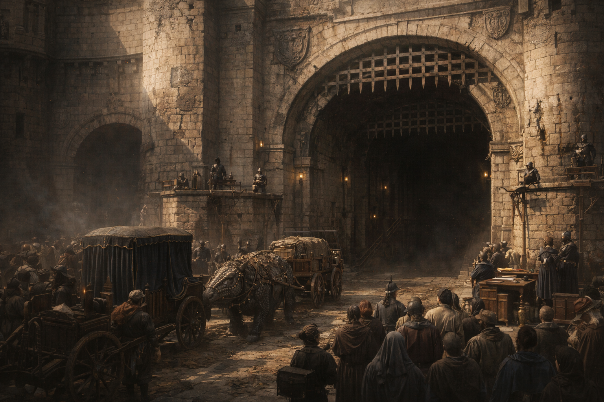

## What players would know

Niederstadt is the city beneath [Hochsilvar](hochsilvar.md): aqueducts, older stone, and neighborhoods the surface insists are “temporary” despite being older than some noble houses. It is where water moves, goods move, and secrets move—especially when streets above are watched.

To live topside is to pretend the undercity is an embarrassment. To live below is to know the undercity is infrastructure.

### Common rumors

- If you can’t move it topside, you move it below.
- The old tunnels weren’t built for the people living there now.

### See also

- [La Compagnia del Ponte Nero](../factions/ponte-nero.md)
- [Refined Magic](../magic/items/refined-magic.md)
- [The Echo Amphitheatre (Niederstadt)](niederstadt-echo-amphitheatre.md)
- [Avenue of Butchers (Niederstadt)](niederstadt-avenue-of-butchers.md)
- [The Deep Market (Niederstadt)](niederstadt-deep-market.md)
