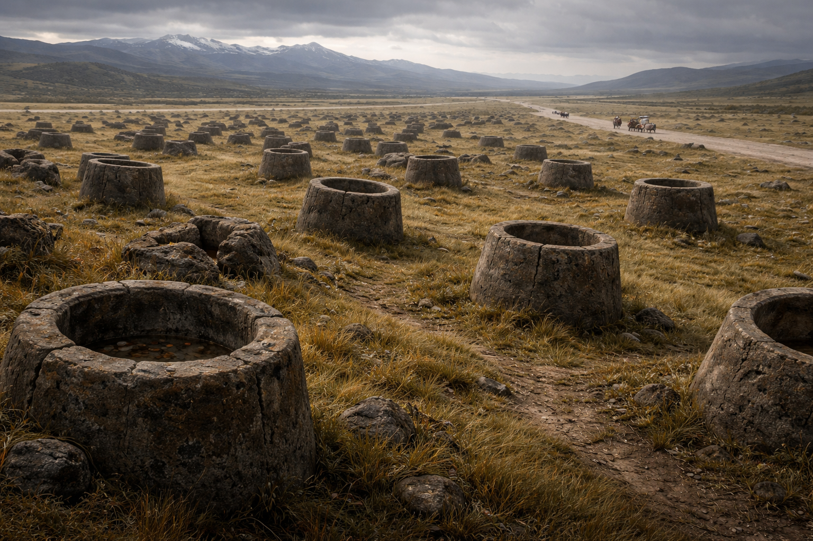

## What players would know

The Plain of Giant’s Cups is a broad, wind-combed grass plain just off a main trade route. Hundreds of squat stone “cups” (more like thick-lipped jars) stand scattered across the field with no obvious pattern.

Each cup is roughly two metres tall and about four metres across. They have no inscriptions, no runes, and no clear tool marks—just stone that looks like it has always been there. Some are cracked or toppled and half-swallowed by turf; others sit improbably intact, their interiors worn smooth by rain and time.

Caravans usually skirt the edge of the plain. Those who cross do it in daylight, keep fires small, and accept without comment that animals get skittish and sound feels oddly “thin” in the open grass.

### Common rumors

- Giants walked the land before the elves “stood upright,” and these were left behind like dropped utensils.
- The cups sometimes “hum” during solstice storms—too low to hear, but enough to feel in your teeth.
- It’s customary to toss a coin or a crust of bread into the nearest cup when passing; nobody remembers why, but most travelers do it anyway.
- After heavy storms, a cup is occasionally found “full”: rainwater, dead birds, or—rarely—perfectly dry salt.

### See also

- [Covenant of the Long Road](../factions/covenant-of-the-long-road.md)
