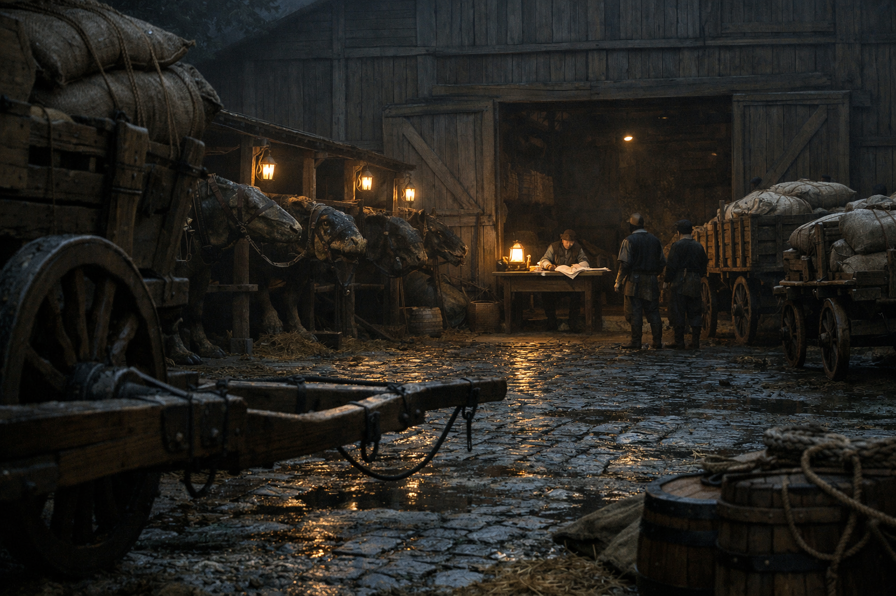

## What players would know

In Niederstadt there are “stables” that don’t smell like stables and “pilgrimage
logistics” offices that seem to know which streets will be closed tomorrow. Most
people only learn the name Ponte Nero when they need a route more than an answer.

### Common rumors

- Their grooms can move a cart through a riot without anyone drawing steel.
- If you pay for “legitimate service,” you might get an illegitimate route anyway.
