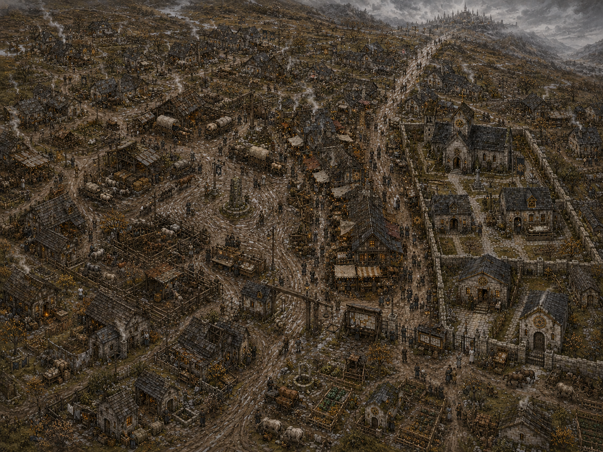
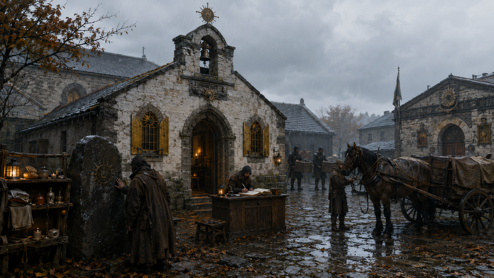
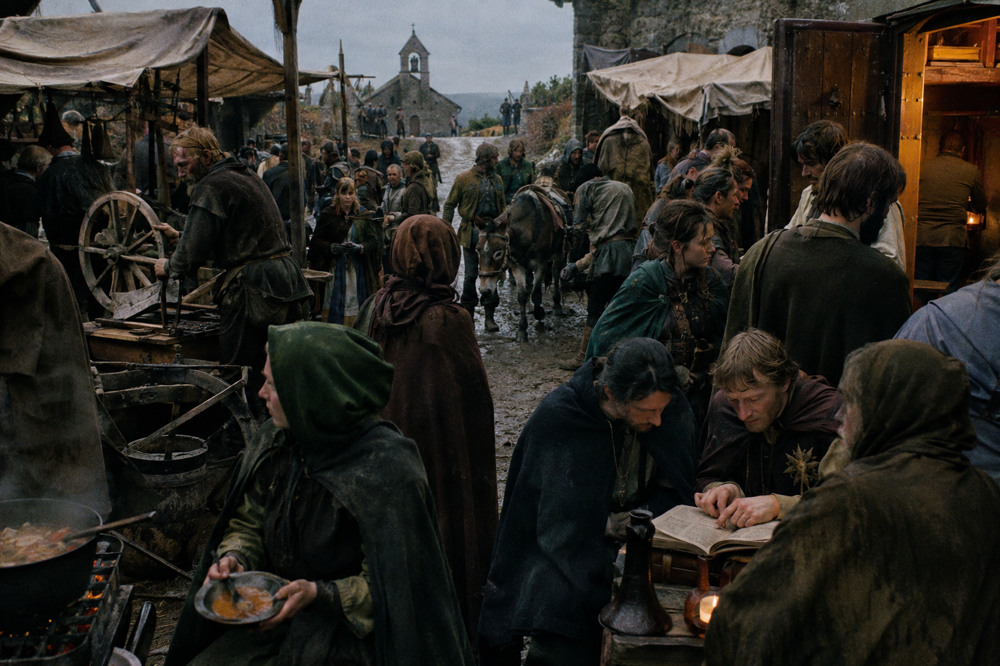

## What players would know

Sankt Orn's Rest is a road town where caravans can add carts, repair wagons,
lodge witnessed messages, and enter the Solar Church's custody system before
the final approach to Valdengratz.

The town grew around an older travelers' commons. Arriving crews still
contribute food, labor, or spare tack to a common store, touch the worn
roadstone at its center, and accept an obligation to aid stranded travelers.
The Church teaches that these are the duties of Saint Orn.

Before using the town's services, arrivals are expected to touch the roadstone
and visit the **kirk**, the small local church in the Solar Court. There they
make a modest offering and receive blessings for travelers, animals, and
wagons. Refusal is lawful, but it places a traveler outside the town's
reciprocal protection.

### Views of Sankt Orn's Rest

### Common rumors

- A service at Sankt Orn's Rest is rarely free, even when no coin changes
  hands; someone records who asked for it.
- The Commons Bench and Solar provost can each delay a wagon, but neither likes
  explaining to the other why.
- Drivers touch the old roadstone before a dangerous leg and argue afterward
  about whether the custom is holy, pagan, or merely sensible.
