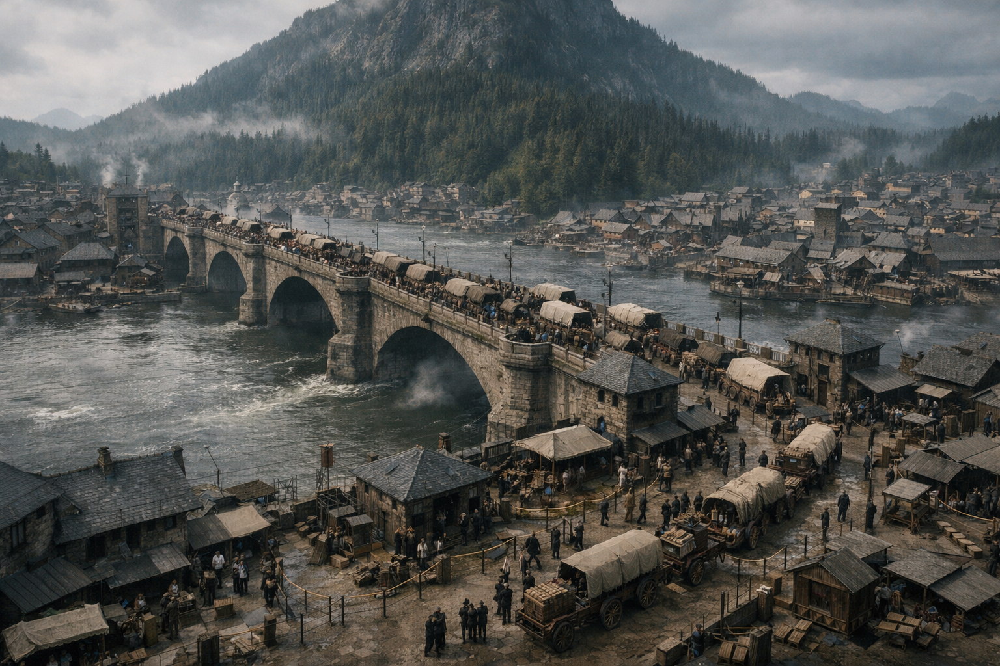

## What players would know

Valdengratz is the big river border-city: customs halls, caravan yards, paperwork, bribes, and “lost” cargo that turns up with a different seal. It is prosperous, watched, and full of people pretending to be ordinary while counting how much the border is worth today.

The border here is not only a line; it’s a market. Everyone sells something: passage, silence, legitimacy, a stamped lid.

### Common rumors

- Customs officers can be bought, but not always twice.
- The border is a market as much as it is a line.
