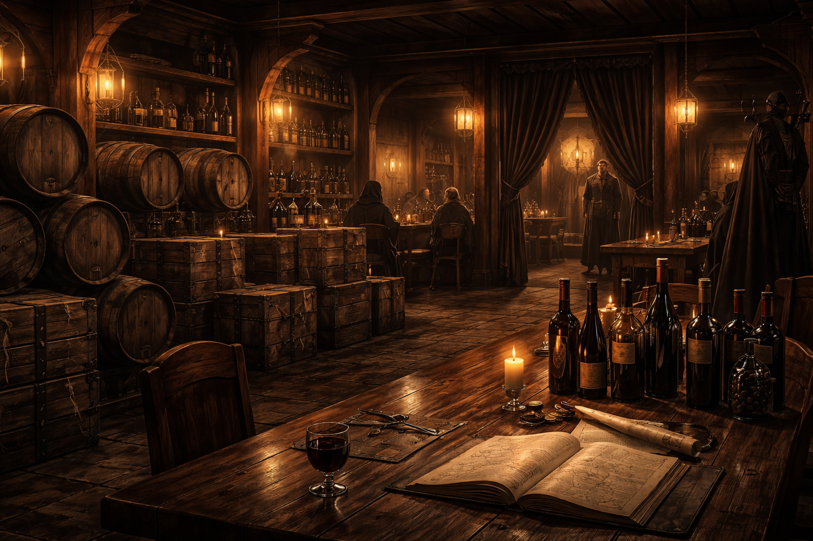

## What players would know

### Illustration (player-safe)

<!-- Replace with a player-safe image path next to this .md. -->

Vellum & Vine is a polished wine merchant and tasting room in Hochsilvar’s wealthy core, where expensive bottles and discreet conversations are sold in equal measure.

Locals treat it as respectable commerce. People who work investigations treat it as a place where courier traffic and client lists matter as much as the wine.

### Common rumors

- If a crate leaves Vellum & Vine without a visible seal, someone powerful already approved it.
- You can buy rare vintages here, but the real product is introductions.
