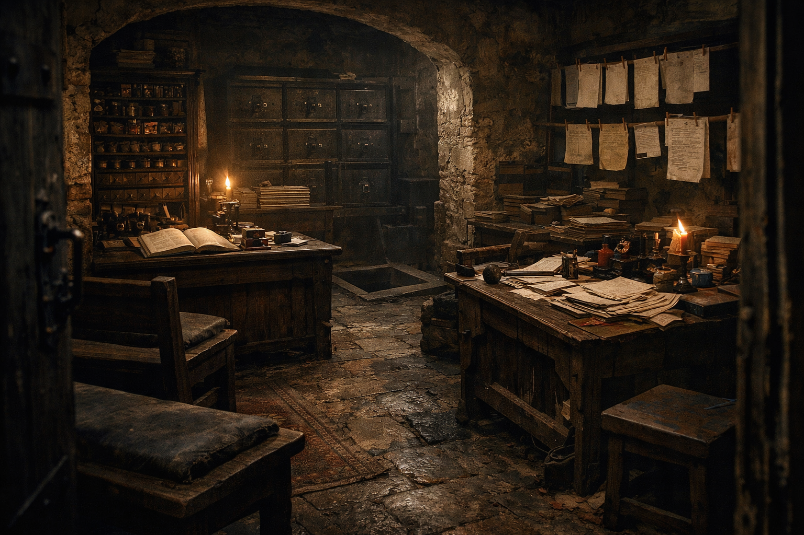

## What players would know

### Illustration (player-safe)

Niederstadt has offices that don’t advertise: basements where ink dries fast, where
your name matters more than your face, and where a stamped receipt can make
contraband look like cargo. If you don’t know where to knock, you’ll never find
them.

### Common rumors

- Some “trade firms” keep their best ledgers below ground.
- Paper can cross borders more easily than people.
