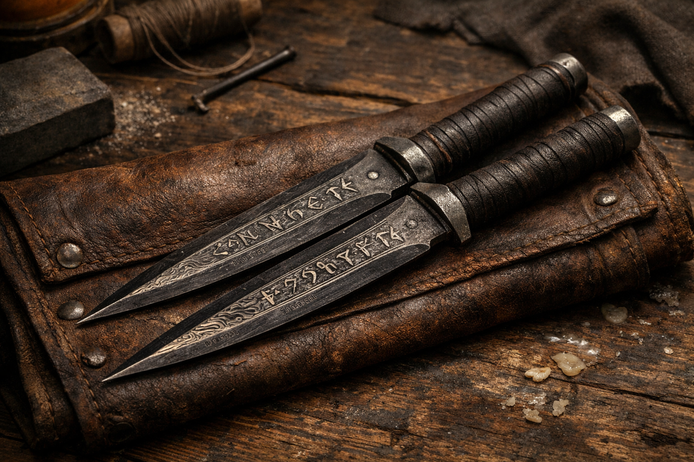

## What players would know

### Illustration (player-safe)

These plain-looking daggers carry a subtle recall enchantment: when thrown, they always come back.

### Use at the table

- Use normal dagger rules.
- When you make a thrown attack with the dagger, it returns to your hand at the end of the attack (hit or miss).
- No attunement required.

### Common rumors

- “There are bureaus that issue these like uniforms.”
- “Some blades come back warm.”
