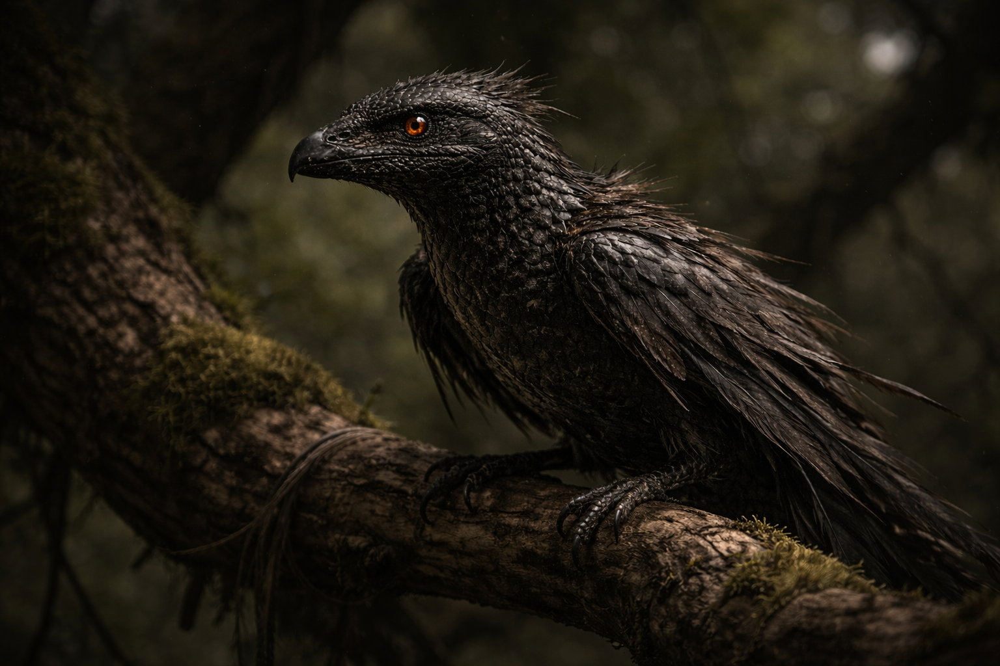

## What players would know

Animal Omen is a druidic divination cast at **sunrise or sunset**. The caster listens for the land’s “answer” in animal behavior—a sign that is more riddle than report.

The omen doesn’t tell you what is out there. It tells you how wrong it is to stay.

### Spell definition

- **School**: Divination (Druid)
- **Casting time**: 1 minute (only at sunrise or sunset; once per day)
- **Range**: 5 km radius (centered on the caster)
- **Components**: V, S (a short chant and a stilling of breath)
- **Duration**: Instant

### How it works

When cast, the DM describes one animal within range behaving in a way that breaks its normal pattern. You understand the **valence** of the omen (safe / uneasy / dangerous / wrong), not exact facts.

### Common rumors

- The omen animal is never the one you _want_; it’s the one the land can spare to speak through.
- Apprentices are taught to watch for patterns, not symbols: wrong timing, wrong routes, wrong fear.
