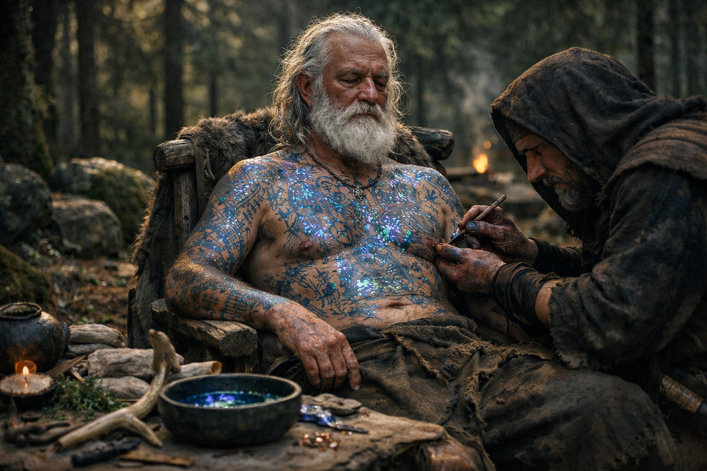

## What players would know

### Illustration (player-safe)

Magical tattoo ink is what happens when spellcraft gets personal. Instead of carving runes into stone or binding power into rings, druids tattoo a working onto skin—lines that glow faintly under the right light and shift color when magic is near.

It’s prized because it can’t be stolen as easily as a wand, and feared because it can’t be set down. Veterans sometimes carry “distressed” tattoos that behave a little differently than they did when fresh—like a scar that learned a new habit.

### Common rumors

- The best ink comes from rare insects and is more valuable than gold by the vial.
- Removing a spell‑tattoo safely is a lie told by people who want your money.

### See also

- [The Living Script](../the-living-script.md)
