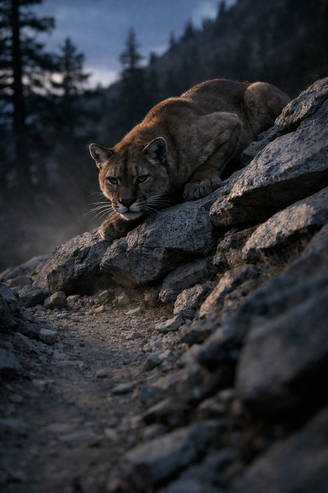

## What players would know

Cougars are silent mountain predators: fast over broken ground, difficult to track, and most dangerous when they can isolate a single target away from the group.

### Common rumors

- If a cougar disappears uphill, it is not retreating; it is repositioning.
- Hunters say the first sign is not a roar but a missing person.
