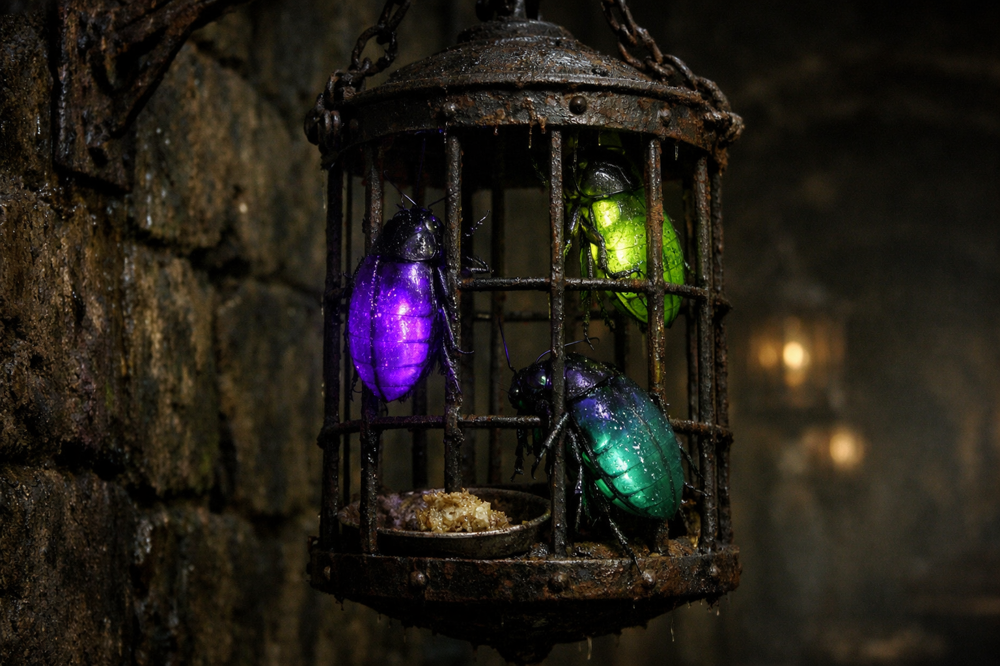

## What players would know

### Illustration (player-safe)

A palm-sized cave beetle used in Niederstadt lamp cages. Its translucent abdomen
gives a steady low glow when fed and healthy.

Most locals treat lamp beetles like moving infrastructure: useful, fragile, and
slightly unsettling up close.

### Common rumors

- A hungry lamp beetle goes from dark purple to weak blue-green.
- Stressed beetles pulse instead of glowing steady.
- If one crawls loose, it will always try to disappear into cracks.

### See also

- [Lamp Feeders (Niederstadt Utility)](../institutions/lamp-feeders-niederstadt.md)
- [Niederstadt](../locations/niederstadt.md)
