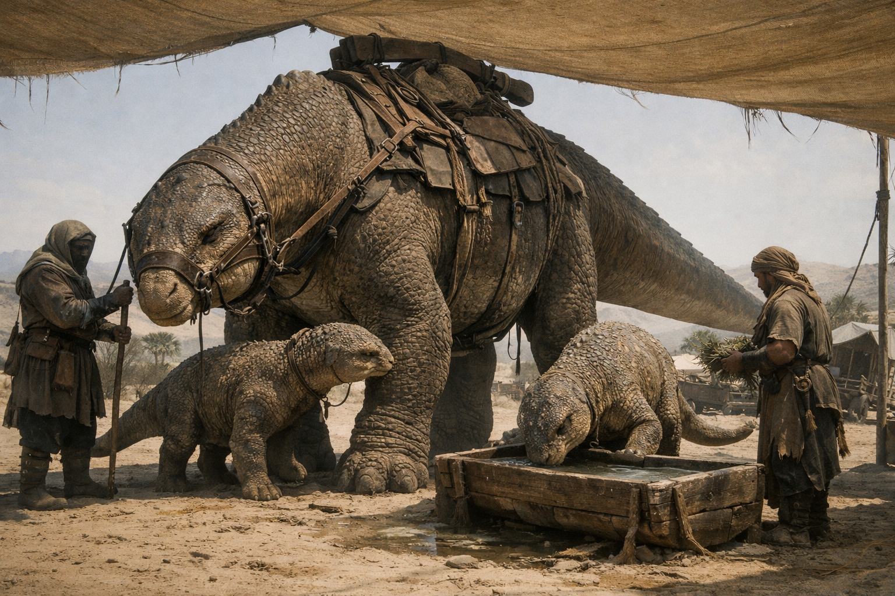

## What players would know

### Illustration (player-safe)

The desert’s great herd reptiles, the saurakh are not “monsters” to the people who survive there. They are mobile water, shelter, and history: massive herbivores built to store and find what the desert refuses to keep in one place.

Caravans follow their routes the way towns follow rivers. When a herd changes its path, markets shift, oases get crowded, and someone’s law becomes someone else’s desperation.

### Common rumors

- A herd can smell water through stone.
- Desert folk drink reptile blood in strict, measured ways and consider wasteful slaughter a kind of madness.
- Some scars on a beast mean it has crossed the same route for longer than any noble line has held a title.

### See also

- [Desert Bamboo (Fast-Growth Trees)](../economy/desert-bamboo.md)
- [The Travelers](../factions/travelers.md)
