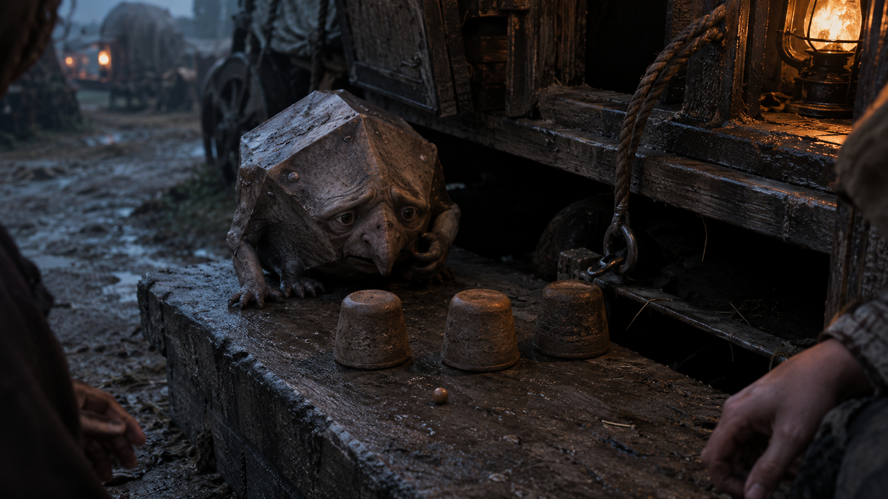

## What players would know

### Illustration (player-safe)

A Styglian Enumerator is a squat, peculiar counting-creature sometimes kept by
warehouses, libraries, caravan factors, and eccentric arithmancers. It mutters
numbers under its breath and compulsively counts whatever holds still long
enough: cups, crates, animals, people, steps, coins, or shadows.

It is not quite a person, but it is not a simple pet either. It has preferences,
irritation, confusion, and attachment. It is useful precisely because it cannot
help counting.

Most look faintly absurd: squat, geometric, long-snouted, and permanently
worried that the universe has been misfiled.

### Common rumors

- An enumerator can count a grain store faster than a tired clerk.
- Some families inherit one the way others inherit a silver service or a
  disputed boundary marker.
- They become distressed by tricks, concealment, and games where the visible
  number remains correct while the hidden truth changes.

