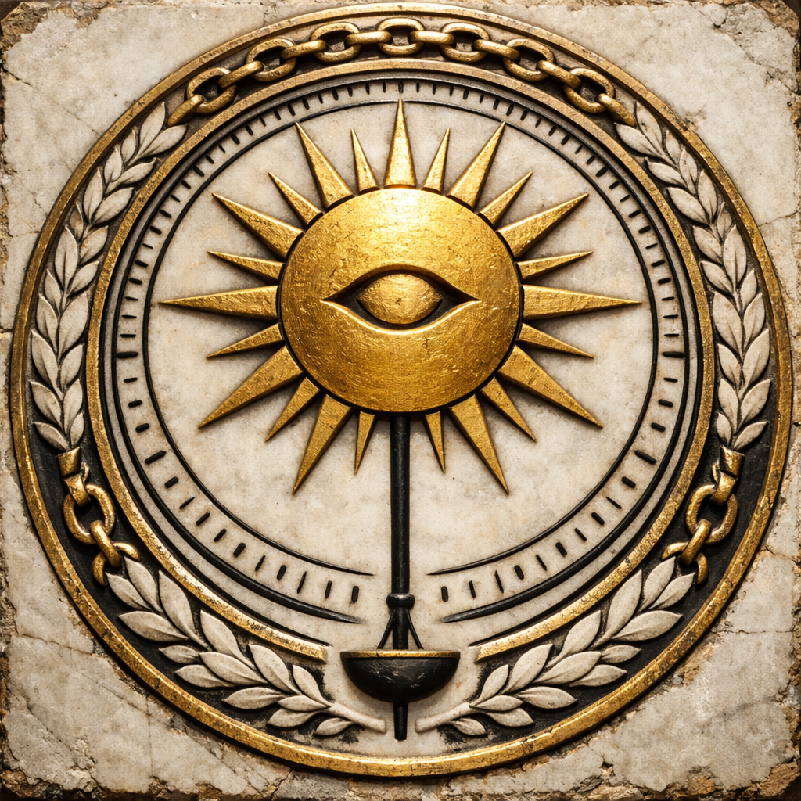

## What players would know

Althar is the Sun of the Empire: a god of law, witness, and the kind of “order” that can be measured, calendared, and enforced. In cities, his Church is everywhere contracts are signed, heirs are recognized, and trials are made to look inevitable.

He is treated as singular, overwhelming, and distant. People don’t talk about “asking” Althar for miracles so much as surviving the right to receive them.

### Illustration

### Common rumors

- The Church doesn’t control the Sun, but it controls the _interface_.
- A “miracle without sacrament” is a political crisis, not just a religious one.
- Priests are calmer than they should be because panic reads like guilt in sunlight.

### See also

- [The Solar Church](../../institutions/solar-church.md)
- [Sacrament Administration](../../institutions/sacrament-administration.md)
- [Creation Myth: Sun, Moon, Forest](../../briefings/creation-myth-sun-moon-forest.md)
